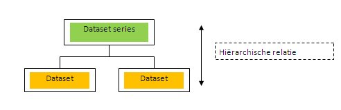
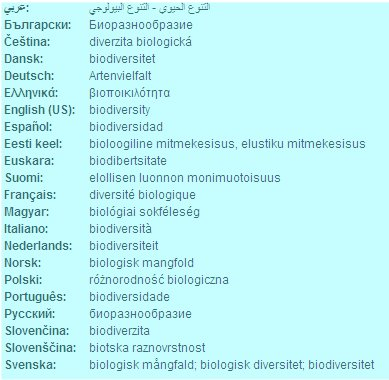
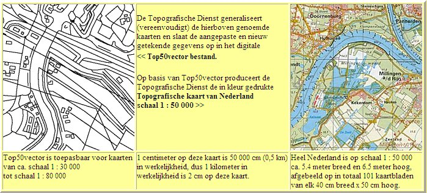
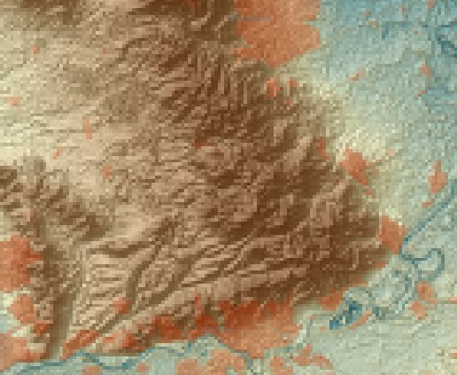
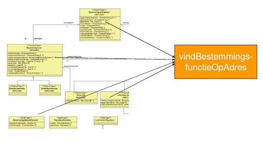
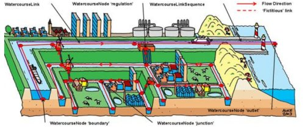

# Metadata elementen

Dit hoofdstuk beschrijft enkele verplichte elementen van het Nederlands profiel iets uitgebreider dan in de specificatie.

## Titel van de bron

Titel van de bron is de naam van de dataset, ook wel titel van de dataset genoemd. Dit is niet de technische naam van de dataset.
Het doel van dit element is de dataset voldoende te identificeren voor de gebruiker. Een meer uitgebreide omschrijving van de dataset kan gegeven worden in een ander veld, namelijk 'samenvatting'. Wanneer er verschillende versies van een bestand in de meta-informatie opgenomen moeten worden, is het aan te raden om de verschillende versienummers op een gelijke wijze in de dataset naam te verwerken. Aanbevolen schrijfwijze voor dit element is:

(projectkenmerk) onderwerp (locatiekenmerk) (jaar) (versie) 
Hierbij zijn de onderdelen tussen haakjes niet verplicht, de andere wel.

Voorbeelden:

1. Digitaal Geologisch Model - Formatie van Kreftenheye onder de Eem 
2. Nationaal Wegen Bestand Wegen 
3. GCN concentratie Stikstofdioxide (NO2) 2020 

## Samenvatting

Met de samenvatting wordt aangegeven de samenvatting van de inhoud van de dataset.
In dit element kan een meer uitgebreide beschrijving van de dataset gegeven worden. 

Voorbeelden:

1. De Nieuwe Kaart van Nederland is een totaaloverzicht van nieuwe ruimtelijke ontwikkelingen. 
2. Het Digitaal Geologisch Model van Nederland (DGM) is een landsdekkend lagenmodel van de ondergrond en brengt het ruimtelijke verloop van de Kwartaire en laat-Tertiaire lithostratigrafische eenheden in kaart. Deze eenheden beslaan grofweg de bovenste duizend meter van de ondergrond. Het model vormt een raamwerk voor verdere toepassingen binnen bijvoorbeeld de hydrologie, geomechanica, geochemie en delfstofwinning. 
3. Het NWB-Wegen is een digitaal geografisch bestand van nagenoeg alle wegen in Nederland. Opgenomen zijn \ alle wegen die worden beheerd door wegbeheerders als het Rijk, provincies, gemeenten en waterschappen, echter alleen voor zover deze zijn voorzien van een straatnaam of nummer. Dus ook losliggende voet- en fietspaden en onverharde wegen zijn, indien voorzien van een straatnaam, in het NWB-Wegen opgenomen. Indien een weg gescheiden rijbanen heeft, wat vooral het geval is bij rijkswegen, worden deze als aparte wegvakken in het bestand verwerkt. In totaal beslaat het NWB-Wegen ongeveer 145.000 kilometer gedigitaliseerde wegvakken (in aantal +/-825000). Het NWB-Wegen wordt 4 keer per jaar geactualiseerd. 
4. Het Planbureau voor de Leefomgeving (PBL) levert jaarlijks kaarten met grootschalige concentratie en depositieniveau's voor Nederland van diverse luchtverontreinigende stoffen waarvoor Europese regelgeving bestaat. De concentratiekaarten met resolutie 1 x 1 km zijn gebaseerd op een combinatie van modelberekeningen en metingen en zijn bedoeld voor het geven van een grootschalig beeld van de luchtkwaliteit in Nederland zowel voor jaren in het verleden als in de toekomst.

## Status

De status van het bestand. Dit element is opgenomen in de Nederlandse kernset, omdat de status van de dataset als zoekcriterium kan dienen en indirect een kwaliteitseigenschap weergeeft. Status kan de volgende waarden bevatten;

| Naam	| Engelse naam	| Beschrijving |
| --- | --- | --- |
| compleet	| completed	| Productie van de data is compleet / afgerond. |
| historisch archief	| historicalArchive	| De data is opgeslagen in een offline opslagmedium. |
| niet relevant	| obsolete	| Data is niet langer relevant. |
| continu geactualiseerd	| onGoing	| Data wordt continu geactualiseerd. |
| gepland	| planned	| Datum is al bekend wanneer de data gecreëerd of geactualiseerd moet zijn. |
| actualisatie vereist	| required	| Data moet nog gegenereerd of geactualiseerd worden. |
| in ontwikkeling	| underDevelopment	| Data wordt momenteel gecreëerd. |

Voorbeelden:

1. onGoing
2. completed


## Hiërarchieniveau

Het element hiërarchieniveau geeft aan waarop de metadata betrekking heeft, de dataset zelf of dataset serie.


Toepassing van metadata op dataset series maak het gebruikers van de metadata mogelijk om op een hoger niveau dan individuele datasets data te zoeken. Metadata van dataset series is geschikt voor het zoeken op globale karakteristieken van beschikbare data, maar niet voor diepgaand onderzoek naar de kwaliteit van specifieke datasets. Hiervoor is metadata van datasets noodzakelijk. De figuur hieronder geeft een schematische weergave van de relatie tussen de metadata van dataset series en datasets zelf weer. De hiërarchische relatie tussen een dataset en dataset serie is altijd van verticale aard.


De kernset van het Nederlands metadata profiel voor geografie geldt niet alleen voor geografische datasets, maar ook voor dataset series. Volgens ISO 19115 is een dataset serie een verzameling geografische data die gelijke karakteristieken hebben ten aanzien van het thema, de resolutie en/of methodologie. Veelal geven dataproducenten aan of er sprake is van een dataset serie.

 

Hierarchieniveau kan de volgende waarden bevatten;

| Naam	| Engelse naam	| Beschrijving |
| --- | --- | --- |
| dataset	| dataset	| Informatie heeft betrekking op de dataset |
| series	| series	| Informatie heeft betrekking op de serie |

Voorbeelden van dataset series zijn:

1. Verzameling luchtfoto’s die in dezelfde vlucht met dezelfde camera en filmtype zijn gemaakt
2. Continue satellietopname van één omwenteling om de aarde
3. Verzameling rasterdata, verkregen uit een algemene serie van papieren kaarten
4. TOP10NL

## Hiërarchieniveau naam

Het element hiërarchieniveau naam bevat de naam van het hiërarchieniveau waarvoor de metadata is beschreven.

Dit element is conditioneel. Het is verplicht als Hiërarchieniveau niet gelijk is aan dataset. Indien het hierarchyniveau dataset is dient dit veld niet ingevuld te worden.
Toepassing van metadata op dataset series maak het gebruikers van de metadata mogelijk om op een hoger niveau dan individuele datasets data te zoeken. Metadata van dataset series is geschikt voor het zoeken op globale karakteristieken van beschikbare data, maar niet voor diepgaand onderzoek naar de kwaliteit van specifieke datasets. Hiervoor is metadata van datasets noodzakelijk. De figuur hieronder geeft een schematische weergave van de relatie tussen de metadata van dataset series en datasets zelf weer. De hiërarchische relatie tussen een dataset en dataset serie is altijd van verticale aard.


De kernset van het Nederlands metadata profiel voor geografie geldt niet alleen voor geografische datasets, maar ook voor dataset series. Volgens ISO 19115 is een dataset serie een verzameling geografische data die gelijke karakteristieken hebben ten aanzien van het thema, de resolutie en/of methodologie. Veelal geven dataproducenten aan of er sprake is van een dataset serie.

Een voorbeeld van een dataset serie is:

AHN Nederland

## Karakterset van de bron

Dit metadata element geeft de gebruikte karakterset aan. Dit zal bijna altijd ‘utf8’ zijn. De karakterset die gecodeerd is volgens de ISO/IEC 10646 standaard, zie tabel hieronder bij beschrijving, voldoet voor niet INSPIRE datasets. Utf8 en utf16 voldoen aan deze standaard.

Voor INSPIRE verplicht als voor de uitwisseling van de bron geen GML wordt gebruikt en de gebruikte karakterset geen utf8 is. Voor niet INSPIRE datasets is het verplicht als de waarde niet voldoet aan de ISO/IEC 10646 standaard.

in deze gevallen een van onderstaande waardes kiezen.


 

Naam	Engelse naam	Beschrijving
ucs2	ucs2	16-bit fixed size Universal Character Set, based on ISO/IEC 10646.
Ucs4	ucs4	32-bit fixed size Universal Character Set, based on ISO/IEC 10646.
Utf7	utf7	7-bit variable size UCS Transfer Format, based on ISO/IEC 10646.
Utf8	utf8	8-bit variable size UCS Transfer Format, based on ISO/IEC 10646.
Utf16	utf16	16-bit variable size UCS Transfer Format, based on ISO/IEC 10646.
8859part1	8859part1	ISO/IEC 8859-1, Information technology – 8-bit single-byte coded graphic character sets – Part 1: Latin alphabet No. 1.
8859part2	8859part2	ISO/IEC 8859-2, Information technology – 8-bit single-byte coded graphic character sets – Part 2: Latin alphabet No. 2.
8859part3	8859part3	ISO/IEC 8859-3, Information technology – 8-bit single-byte coded graphic character sets – Part 3: Latin alphabet No. 3.
8859part4	8859part4	ISO/IEC 8859-4, Information technology – 8-bit single-byte coded graphic character sets – Part 4: Latin alphabet No. 4.
8859part5	8859part5	ISO/IEC 8859-5, Information technology – 8-bit single-byte coded graphic character sets – Part 5: Latin/Cyrillic alphabet.
8859part6	8859part6	ISO/IEC 8859-6, Information technology – 8-bit single-byte coded graphic character sets – Part 6: Latin/Arabic alphabet.
8859part7	8859part7	ISO/IEC 8859-7, Information technology – 8-bit single-byte coded graphic character sets – Part 7: Latin/Greek alphabet.
8859part8	8859part8	ISO/IEC 8859-8, Information technology – 8-bit single-byte coded graphic character sets – Part 8: Latin/Hebrew alphabet.
8859part9	8859part9	ISO/IEC 8859-9, Information technology – 8-bit single-byte coded graphic character sets – Part 9: Latin alphabet No. 5.
8859part10	8859part10	ISO/IEC 8859-10, Information technology – 8-bit single-byte coded graphic character sets –Part 10: Latin alphabet No. 6.
8859part11	8859part11	ISO/IEC 8859-11, Information technology – 8-bit single-byte coded graphic character sets –Part 11: Latin/Thai alphabet.
(gereserveerd voor toekomstig gebruik)	(reserved for future use)	a future ISO/IEC 8-bit single-byte coded graphic character set (e.g. possibly 8859-12).
8859part13	8859part13	ISO/IEC 8859-13, Information technology – 8-bit single-byte coded graphic character sets –Part 13: Latin alphabet No. 7.
8859part14	8859part14	-ISO/IEC 8859-14, Information technology – 8-bit single-byte coded graphic character sets – Part 14: Latin alphabet No. 8 (Celtic).
8859part15	8859part15	ISO/IEC 8859-15, Information technology – 8-bit single-byte coded graphic character sets –Part 15: Latin alphabet No. 9.
8859part16	8859part16	ISO/IEC 8859-16, Information technology – 8-bit single-byte coded graphic character sets –Part 16: Latin alphabet No. 10.
Jis	jis	Japanese code set used for electronic transmission.
shiftJIS	shiftJIS	Japanese code set used on MS-DOS based machines.
eucJP	eucJP	Japanese code set used on UNIX based machines.
usAscii	usAscii	United states ASCII code set (ISO 646 US).
Ebcdic	ebcdic	Ibm mainframe code set.
eucKR	eucKR	Korean code set.
Big5	big5	Traditional Chinese code set used in Taiwan, Hong Kong of China and other areas.
GB2312	GB2312	Simplified Chinese code set.

## Distributie

### Naam distributie formaat

Dit element bevat de naam van het distributie formaat van de dataset. Dit element is conditioneel in dit profiel. Het is alleen verplicht als de dataset een INSPIRE bron is.  De presiese informatie over hoe de naamgeving van het applicatie schema is, is te vinden in de INSPIRE dataspecificaties in de paragraaf genaamd Encoding.


Voorbeeld:

Hydrography GML application schema

### Versie distributie formaat

Dit element bevat de versie van het distributie formaat van de dataset.

Dit element is conditioneel in dit profiel. Het is alleen verplicht als de dataset een INSPIRE bron is.  Deze informatie is te vinden in de INSPIRE dataspecificaties in de paragraaf genaamd Encoding.


Voorbeeld:

version 3.0; GML, version 3.2.1

### Specificatie distributie formaat

Dit element bevat de specificatie van het distributie formaat van de dataset.

Dit element is conditioneel in dit profiel. Het is alleen verplicht als de dataset een INSPIRE bron is.  De presiese informatie is te vinden in de INSPIRE dataspecificaties in de paragraaf genaamd Encoding.


Voorbeeld:

D2.8.I.8 Data Specification on Hydrography – Guidelines
## URL

Het metadata element URL bevat een valide URL voor online toegang tot de bron, bijvoorbeeld naar een WMS of een zip bestand, of als er niet een directe link naar de bron aanwezig is naar een locatie waar informatie over de bron beschikbaar is, zoals een loket of catalog.


Door een relatie te leggen naar een dataservice is het mogelijk om op de metadata van de data te zoeken en de data via de service ervan te tonen. De service heeft ook metadata, maar daarin is geen informatie over de inhoud van de data opgenomen.

Door het element protocol weet men om wat voor soort info het gaat, een bestand voor download, een service etc.


In dit elementen wordt maar één maal per servicetype (WMS,WFS) de relatie gelegd, waarmee de dataset als service gerepresenteerd wordt, zodat het mogelijk wordt de dataset via een service te benaderen. Het is niet de bedoeling om een relatie te leggen naar elke service waarin de dataset is opgenomen.


Het is wel mogelijk om zowel een URL naar een bestand voor downloaden op te nemen als een URL naar een WMS. De elementen protocol en naam moeten dan ook meerdere keren worden ingevuld


Voor een service dient de URL gelijk te zijn aan het metadata element resource locator uit het Nederlands metadata profiel op ISO19119 voor services.


In versie 1.2 van dit profiel is de conditie: Het element URL is conditioneel. Het is verplicht als er een link is naar (meer informatie over) de bron. Bijvoorbeeld naar een zip bestand, een catalog, een data loket, WMS of WFS.


In versie 1.3 van het profiel is de conditie verandert in: Dit element is conditioneel. Het is voor INSPIRE verplicht als er een link is naar meer informatie over de bron en / of er een link is die toegang geeft tot gerelateerde services, ook al is die service voorzien van metadata. Voor datasets die buiten INSPIRE vallen en waarvoor gerelateerde services aanwezig zijn, is het verplicht als er nog geen service metadata is. Het element kan meerdere keren voorkomen, bijvoorbeeld als link naar een zip bestand, een catalogus, een data loket, WMS en WFS.

Voorbeelden:

1. http://www.dinoservices.nl/wms/dinomap/M09M0817 
2. \\COM5494\G$\nwb_wegen\geogegevens\shapefile\nederland_totaal\hectopunten\hectopunten.shp 
3. http://geoservice.pbl.nl/website/gcn/Stikstofdioxide/2020

## Protocol

Het metadata element bevat het protocol voor het afhandelen van de URL. De URL kan zowel een link zijn naar een bestand om te downloaden als naar een service of een catalog. Het element protocol geeft aan wat voor URL het betreft. Onder download vallen bijvoorbeeld ZIP, PDF en Word documenten.

Het element protocol, is van belang voor het automatisch kunnen downloaden van de dataset, en/of het benaderen van de service die deze dataset representeert. Het maakt gebruik van een codelijst die het Nederlandse metadata profiel op ISO19119 wordt vastgelegd, maar het element is een ISO19115 element. Door gebruik te maken van deze codelijst is de invulling van het element software onafhankelijk.

Dit element is conditioneel. Het is verplicht als er een URL is opgegeven. Bijvoorbeeld naar een zip bestand, WMS of WFS.

Voor protocol kunnen de volgende waarden worden gebruikt; 

| Naam	| Beschrijving | 	MD IR Name | 
| OGC:CSW	| Web Catalog service	| Discovery Service | 
| OGC:WMS	| Web Map service	| View Service | 
| OGC:WFS	| Web Feature Service	| Download Service | 
| OGC:WCS	| Web Coverage Service	| Download Service | 
| OGC:WCTS	| Web Coordinate Transformation Service | 	Transformation Service | 
| OGC:WPS	| Web Processing Service	| Invoke Spatial Data Service | 
| UKST	| Unknown Service Type	| Other Services | 
| OGC:WMC	| Web Map Context | | 	
| OGC:KML	| Keyhole Mark-up Language	| | 
| OGC:GML	| Geography Markup Language	| | 
| OGC:WFS-G	| Gazzetteer service	| | 
| OGC:SOS	| Sensor Observation Service | | 	
| OGC:SPS	| Sensor Planning Service | | 	
| OGC:SAS	| Sensor Alert Service	| | 
| OGC:WNS	| Web Notification Service	| | 
| OGC:ODS	| OpenLS Directory Service	| | 
| OGC:OGS	| OpenLS Gateway Service	| | 
| OGC:OUS	| OpenLS Utility Service	| | 
| OGC:OPS	| OpenLS Presentation Service	| | 
| OGC:ORS	| OpenLS Route Service	| | 
| website	| website	| | 
| download	| download	| | 


Voorbeelden:

1. OGC:WMS
2. Download
3. website

## Naam

Het metadata element Naam legt de relatie naar de layer in de service die de dataset representeert, door middel van de naam van de layer of de naam van het featuretype. In dit element wordt maar één maal per servicetype een relatie gelegd, waarmee de dataset als service gerepresenteerd wordt. Op deze manier is het mogelijk een dataset via een service te benaderen. Het is niet de bedoeling dat een link wordt gemaakt naar elke service die de dataset representeerd.

Het element naam is conditioneel. De naam is verplicht gemaakt in Nederland voor OGC:WMS, OGC:WFS en OGC:WCS. Het element bevat de layer name van de WMS of WCS of de featurType naam van een WFS.

Voorbeeld:

1. krzudrillings
2. brug

## Unieke Identifier van de bron

De unieke Identifier van de bron bevat de waarde die de dataset uniek identificeert.


Geadviseerd wordt om gebruik te maken van een betekenisloze identifier die wereldwijd uniek is zoals de Universal Unique Identifier. Meer informatie hierover is te vinden op Universally Unique Identifier (wikipedia)

Voorbeelden:

1. d9e6e866-5371-447e-a8dd-3647c104c3fa
2. 0a11ef03-5db9-69a1-b3b9-135b19609b30 
3. 78fa0292-aa3f-43fb-a182-3b52534b87a4 
4. d3c28e47-8b7e-4f24-84b4-f0cfda3ee02e 

## Taal van de bron

Dit metadata element geeft de taal aan de attributen van de dataset zijn beschreven. Dit zal bijna altijd ‘Nederlands’ zijn. De talen worden gecodeerd volgens de ISO 639-2 norm “Codes for the representation of names of languages”. Gebruik hiervoor alleen de drie letter codes van ISO639-2/B, zoals gedefinieerd op http://www.loc.gov/standards/iso639-2/


Dit element is conditioneel. Het is verplicht als de bron tekstuele informatie bevat. Het bevat de code van de taal waarin de tekst in de bron is opgenomen.


De codes voor de 23 officiële EU talen zijn:

| Bulgarian	| bul	| Italian	| ita | 
| Czech	| cze	| Latvian	| lav | 
| Danish	| dan	| Lithuanian	| lit | 
| Dutch	| dut	| Maltese	| mlt | 
| English	| eng	| Polish	| pol | 
| Estonian	| est	| Portuguese	| por | 
| Finnish	| fin	| Romanian	| rum | 
| French	| fre	| Slovak	| slo | 
| German	| ger	| Slovenian	| slv | 
| Greek	| gre	| Spanish	| spa | 
| Hungarian	| hun	| Swedish	| swe | 
| Irish	| gle		
 

## Onderwerp

Het onderwerp bevat de belangrijkste omschrijving van de dataset. Dit kunnen meerdere onderwerpen voor een dataset zijn, maar niet uitputtend. Deze lijst is door ISO vastgesteld. Wijzigingen daarop zijn moeilijk door te voeren.


De mogelijke waardes voor onderwerp zijn;
Naam	Engelse naam	Beschrijving
landbouw 
en veeteelt	farming	Houden van dieren en/of verbouwen van planten.
Vb: landbouw, irrigatie, ziekten die gewassen aantasten.
biota	biota	Flora en fauna in natuurlijke omgeving.
Vb: habitats, ecologie.
grenzen	boundaries	Wettelijke gebiedsbeschrijvingen.
Vb: politieke en administratieve grenzen.
klimatologie, meteorologie atmosfeer	climatologyMeteorologyAtmosphere	Processen en fenomenen in de atmosfeer.
Vb: wolkbedekking, weer, klimaat verandering.
economie	economy	Economische activiteiten, condities en werkgelegenheid.
Vb: werkgelegenheid, industrie, toerisme, olie- en gasvelden, bosbouw, visserij.
hoogte	elevation	Hoogte boven of onder zeeniveau.
Vb: hoogtekaart, DEM, hellingen.
natuur en milieu	environment	Natuurlijke bronnen, bescherming en beheer.
Vb: milieuverontreiniging, landschap, natuurlijke reserves, vuilopslag.
Geo wetenschap-pelijke data	geoscientificInformation	Data die behoort tot een aardwetenschap.
Vb: geologie, mineralen, structuur van de aarde, zwaartekrachtskaart, grondstoffen, erosie.
gezondheid	health	Gezondheid(szorg), menselijke ecologie en veiligheid.
Vb: ziekten, hygiëne, gezondheidszorg.
referentie materiaal aardbedekking	imageryBaseMapsEarthCover	Basiskaarten.
Vb: landbedekking, topografische kaarten, foto’s, ongeclassificeerde kaarten.
militair	intelligenceMilitary	Militaire basissen, structuren en activiteiten.
Vb: barakken, oefenterreinen, militaire transporten.
binnenwater	inlandWaters	Binnenwater, drainagesystemen en hun karakteristieken.
Vb: rivieren en gletsjers, dijken, stromen, waterzuiveringsinstallaties, overloopgebieden.
locatie	location	Positionele informatie en services.
Vb: adressen, geodetisch netwerk, postcode gebieden, plaatsnamen, controlepunten.
oceanen	oceans	Gebieden met zoutwaterlichamen (niet binnenlands). 
Vb: getijden, tsunami’s, kustinformatie, riffen.
planning kadaster	planningCadastre	Informatie die gebruikt wordt voor nodige planmatige activiteiten.
Vb: landgebruik, kadastrale informatie.
maatschappij	society	Kenmerken van maatschappij en culturen.
Vb: antropologie, archeologie, criminaliteit, gewoonten, nederzettingen, onderwijs.
(civiele) structuren	structure	Civiele werken (door mensen gemaakte structuren).
Vb: gebouwen, musea, kerken, winkels, torens.
transport	transportation	Middelen voor vervoer van goederen en/of personen.
Vb: wegen, vliegvelden, tunnels, spoorwegen.
nutsbedrijven communicatie	Communication	 Energie, waterleidingen en riolering en communicatie infrastructuren en services.
Vb: elektriciteit- en gasdistributie, waterzuivering en verstrekking, telecommunicatie, radio.


Voorbeelden:

1. location 
2. geoscientificInformation 
3. transportation 
4. climatologyMeteorologyAtmosphere

## Trefwoord

Trefwoord bevat in het algemeen gebruikte woorden of geformaliseerde zinnen om een dataset of dataset serie te beschrijven. Dit kunnen trefwoorden uit een thesaurus zijn maar ook zelf gedefinieerde trefwoorden. Er kunnen meerdere trefwoorden worden gebruikt, maar het is geen uitputtende lijst.


Datasets en dataset series die zijn aangemerkt als INSPIRE bron, beschrijven in ieder geval het INSPIRE thema waar de dataset onder valt. Voor INSPIRE wordt gebruik gemaakt van de GEMET thesaurus. Daarin worden de INSPIRE thema’s opgenomen, zie  http://www.eionet.europa.eu/gemet/inspire_themes


Voorbeelden:
1. Ruimtegebruik, Planologie
2. Geologie 
3. Transport, infrastructuur, verkeersgegevens, wegen
4. Live Data and Maps

## Thesaurus

Een thesaurus is een lijst met trefwoorden die ontleend zijn aan het dagelijks taalgebruik van professionals. In de thesaurus wordt de betekenis van trefwoorden vastgelegd door relaties te benoemen met synonieme begrippen, bredere, specifiekere en verwante begrippen en door een uitleg bij de trefwoorden. Voor INSPIRE wordt gebruik gemaakt van de GEMET thesaurus. Daarin worden de INSPIRE thema’s opgenomen. Zie  http://www.eionet.europa.eu/gemet/inspire_themes 


Thesaurus een conditioneel element. Het thesaurus element is verplicht als een trefwoord uit een thesaurus afkomstig is zoals in ieder geval voor de INSPIRE thema’s. Het bevat de naam van de thesaurus waar het trefwoord uit afkomstig is.


Voorbeeld:
“GEMET Thesaurus version 1.0”



## Thesaurus datum

Het bevat de creatie-, publicatie-, of wijzigingsdatum, van de thesaurus waar het trefwoord uit afkomstig is. Het formaat van de datum is JJJJ-MM-DD (met streepjes).

Dit is een conditioneel element. Het is verplicht als een trefwoord uit een thesaurus afkomstig is zoals in ieder geval voor de INSPIRE thema’s.


Voorbeeld:
2009-05-15

## Thesaurus datum type

Het thesaurus datum type element bevat het type gebeurtenis waar de datum betrekking op heeft.


Dit is een conditioneel element. Het is verplicht als een trefwoord uit een thesaurus afkomstig is zoals in ieder geval voor de INSPIRE thema’s.

Mogelijke waarden zijn;


| Naam |	Engelse naam |	Beschrijving |
| --- | --- | --- |
| creatie | 	creation |	Datum waarop de dataset of dataset serie is gecreëerd. |
| publicatie | publication | Publicatie datum waarop de dataset of dataset serie is gepubliceerd. |
| revisie | revision | Datum waarop de dataset of dataset serie is gecontroleerd, verbeterd of is gewijzigd. |


Voorbeeld;
publication

## Minimum x/y, maximum x/y-coördinaten

Deze elementen bevatten de meest westelijke, zuidelijk, oostelijk en noordelijke coördinaten uit de dekking van de dataset weergegeven in longitude en lattitude in decimale graden (noord en oost als positieve waarden). De coördinaten dienen te worden weergegeven volgens referentiesysteem WGS84. Als de coordinaten niet (in WGS 84) bekend zijn kan de volgende tool ze opzoeken en/of omrekenen naar WGS 84

Voorbeeld;
2.50 

## Temporele dekking

Dit element bevat de periode waarop de data betrekking heeft. Dit kan een tijdsinterval zijn maar ook een datum. De overall tijdsperiode gedekt door de inhoud van de bron kan een samenstelling zijn van een of meer waarden.

Het formaat van de datum is JJJJ-MM- DD (met streepjes) of JJJJ-MM-DDTUU:MM:SS (met streepjes T van time en dubbele punt).


In versie 1.3 van dit profiel is dit element optioneel geworden.


Voorbeelden:
1. 2000-01-01 of 2030-12-31
2. 0000
3. 2008-10-01 of 2009-01-01
4. 2020

## Datum van de bron

Het metadata element datum van de bron geeft de creatie-, publicatie-, of wijzigingdatum van de dataset. Het formaat van de datum is JJJJ-MM-DD (met streepjes).


Voorbeelden:

1. 2008-11-20 
2. 2008-11-04 
3. 2008 
4. 2008-03-01

## Datum type van de bron

Het element datum type van de bron bevat het type gebeurtenis waar de datum betrekking op heeft. 

Mogelijke waarden zijn;

| Naam |	Engelse naam |	Beschrijving |
| --- | --- | --- |
| creatie | 	creation |	Datum waarop de dataset of dataset serie is gecreëerd. |
| publicatie | publication | Publicatie datum waarop de dataset of dataset serie is gepubliceerd. |
| revisie | revision | Datum waarop de dataset of dataset serie is gecontroleerd, verbeterd of is gewijzigd. | 

Voorbeelden:

1. publication
2. creation

## Niveau kwaliteitsbeschrijving

Het niveau kwaliteitsbeschrijving beschrijft het niveau waarop de kwaliteitsinformatie betrekking heeft. ISO bevat ook de mogelijkheden om bijvoorbeeld op feature niveau kwaliteitsinformatie op te nemen, waardoor hier expliciet moet worden vermeld om welk niveau het gaat. Voor Nederland hebben we deze codelijst beperkt. Vanf versie 1.3 van dit profiel is ook de waarde featureType mogelijk.

Als voor INSPIRE het niveau featureType wordt gekozen dient het element features te worden gebruikt om de featuretype namen in op te nemen.

Het element hierarchieniveau bevat in wezen dezelfde informatie, maar met het doel aan te geven waar de beschrijving van de metadata over gaat.


Niveau kwaliteitsbeschrijving kan de volgende waarden bevatten; 
Naam	Engelse naam	Beschrijving
dataset	dataset	Informatie heeft betrekking op de dataset.
series	series	Informatie heeft betrekking op de serie
featureType	featureType	Informatie heeft betrekking op het featuretype


## Algemene beschrijving herkomst

Dit element beschrijft de proceshistorie; waar de gegevens vandaan komen en/of hoe de dataset vervaardigd is. Ook kwaliteitsinformatie kan hierin worden opgenomen. Kwaliteitsinformatie kan meerdere keren worden opgenomen. Er dient slechts één set kwaliteitsinformatie opgenomen worden die betrekking heeft op de gehele dataset. Hierin wordt ook het element algemene beschrijving herkomst opgenomen.


Voorbeelden:
1. Plannen en projecten zijn aangeleverd door verschillende overheden (Rijk, Provincies, Gemeenten en Waterschappen). 
2. Modelberekening op basis van boringen, sonderingen e.a. uit de DINO database
3. Opgenomen zijn alle wegen die worden beheerd door wegbeheerders als het Rijk, provincies, gemeenten en waterschappen, echter alleen voor zover deze zijn voorzien van een straatnaam of nummer. Dus ook losliggende voet- en fietspaden en onverharde wegen zijn, indien voorzien van een straatnaam, in het NWB-Wegen opgenomen. Indien een weg gescheiden rijbanen heeft, wat vooral het geval is bij rijkswegen, worden deze als aparte wegvakken in het bestand verwerkt.
4. De concentratiekaarten met resolutie 1 x 1 km zijn gebaseerd op een combinatie van modelberekeningen en metingen

## Toepassingsschaal 

Met de toepassingsschaal wordt de beoogde schaal bedoeld waarop het bestand waarheidsgetrouw gebruikt mag worden.


Een dataset kan ook een bepaalde mate van algemeenheid of juist gedetailleerdheid hebben. Dit is vaak afhankelijk van het doel van de dataset. Waar een gemeentebestuurder vrij precies zou willen weten waar huizen staan, heeft een bestuurder op landsniveau misschien genoeg aan een globaal overzicht van bebouwing. Let op: de schaal 1:10.000 is groter dan een schaal 1:250.000. De schaal is zo waarheidsgetrouw als de schaal waarop de gegevens zijn ingewonnen.


Dit element is conditioneel. Het is verplicht als er een toepassingsschaal gespecificeerd kan worden. Het element kan twee keer voorkomen, hiermee wordt een interval aangegeven. Alleen het schaalgetal wordt opgegeven, niet de “1:”


Voorbeelden:
1. 50000 
2. 250000 
3. 10000 100000 
4. 25000 



## Resolutie

Resolutie kan op verschillende manieren verklaard worden:
(a) Het kleinst mogelijke detail dat nog juist kan worden onderscheiden of afgebeeld.
(b) Het aantal lijnen per mm dat onder optimale omstandigheden door een lens kan worden onderscheiden.
(c) De kleinste stapgrootte in x- en y-coördinaten die een digitizer* kan registreren of op een beeldscherm* dan wel via een tekenautomaat* verwerkbaar is.
(d) Het kleinste grondoppervlak dat door een opnamesysteem (multispectrale scanning, radar) apart wordt geregistreerd.


In dit geval gaat het om de laatste definitie. Dit element is conditioneel. Het is verplicht als er een resolutie gespecificeerd kan worden. De afstand  wordt in meters opgenomen. Het element kan twee keer voorkomen, hiermee wordt een interval aangegeven.


Voorbeeld;
3 



## Code Referentiesysteem

Het code Referentiesysteem geeft de identificatie van het coördinatenstelsel waarop de dataset is gebaseerd.


Dit element bevat de code die het gebruikte referentiesysteem van de dataset aangeeft. De European Petroleum Survey Group (EPSG) geeft deze code’s uit. De EPSG heeft in 1985 voor intern gebruik een database opgezet met geodetische parameters. In 1993 is deze database beschikbaar gesteld als referentie voor het Petrotechnical Open Software Corporation data model. De database wordt nu beheerd door International Association of Oil & Gas producers (OGP). De EPSG geodetische parameter database is een repository die:
• Coördinaten identificeert zodat de positie van deze coördinaten op een ondubbelzinnige manier wordt beschreven. Dit wordt bereikt door de definitie van een coordinate reference system (CRS)
• Transformaties en conversies definieert en coördinaten van het ene naar het andere CRS omzet.


De EPSG codes kunnen gevonden worden op de website van OGP. Aanbevolen wordt om de MSAccess database van de site te downloaden


Voor het Rijksdriehoeksstelsel (RD) wordt de code 28992 gehanteerd, 4937 voor ETRS89 en 4326 voor WGS84.


Naast het horizontale ruimtelijk referentiesysteem kan ook het verticaal ruimtelijk referentiesysteem in de metadata worden opgeslagen, bijvoorbeeld NAP. Deze gegevens kan men in het optionele element Code verticaal referentiesysteem plaatsen. EPSG 5621 is toegewezen aan EVRF2007 Height en code 5709 voor NAP.


Voor de ruimtelijke extent wordt ETRS89 gebruikt. Hiermee wordt het mogelijk gemaakt om op europees niveau data te doorzoeken.


Voorbeeld:
28992

## Temporeel referentiesysteem

Dit element is conditioneel in dit profiel. Het is alleen verplicht als de dataset temporele informatie bevat die niet gebaseerd is op de Gregoriaanse kalender of de Coordinated Universal Time. Dit element bevat de Alfanumerieke waarde die het gebruikte referentiesysteem van de dataset aangeeft.


Voorbeeld:

Juliaanse kalender

## Verantwoordelijke organisatie voor namespace referentiesysteem

Het metadata element 'Verantwoordelijke organisatie voor namespace referentiesysteem' bevat de naam of identificatie van de persoon of organisatie die verantwoordelijk is voor de de uitgave van de codes (van het referentie systeem). Gebruik hiervoor standaard EPSG.


Voorbeeld:
EPSG


## Conformiteitindicatie met de specificatie

Met de 'conformiteitindicatie met de specificatie' kan worden weergegeven of de dataset wel of niet conform de INSPIRE specificatie of een ander specifiek informatie model is opgebouwd. Dit element is conditioneel in dit profiel. Het is alleen verplicht als de dataset een INSPIRE bron is of als de informatie is gemodelleerd volgens een specifiek informatie model.


Voor business services is het essentieel dat een informatiemodel (conform de systematiek van NEN361018) aanwezig is dat de semantiek beschrijft. Vanuit dit informatiemodel kunnen afgeleide services betekenisvol gedefinieerd worden.



Een ander essentieel voordeel is dat met de Model Driven Approach (MDA) vanuit UML tools zoals Enterprise Architect Services direct gedefinieerd kunnen worden waarna vervolgens XML, GML of WSDL automatisch gegenereerd wordt. Door deze aanpak is de samenhang geborgd in het model en met de afgeleide services op basis van het informatiemodel.


Voorbeeld:
TRUE

### Verklaring

De verklaring bevat de betekenis van de conformiteit. Aangegeven kan worden op welke punten de dataset wel of niet conform een informatiemodel of dataspecificatie is.


Dit element is conditioneel. Het is alleen verplicht als de dataset een INSPIRE bron is of als de informatie is gemodelleerd volgens een specifiek informatiemodel. 

Voorbeeld:
De hier gehanteerde domeinen wijken af van de domeinen uit de dataspecificaties van INSPIRE

### Specificatie

Het element specificatie bevat de titel van de specificatie of richtlijnen of informatiemodel waar de dataset conform aan dient te zijn.


Dit element is conditioneel in dit profiel. Het is alleen verplicht als de dataset een INSPIRE bron is of als de informatie is gemodelleerd volgens een specifiek informatie model.


Voorbeeld:
IMRO2008
INSPIRE D2.8.I.5 Data Specification on Addresses

### Specificatie datum

Het metadata element specficatie datum bevat de datum van de specificatie of richtlijnen of informatiemodel waar de dataset conform aan dient te zijn. Het formaat van de datum is JJJJ-MM-DD (met streepjes). In specificatie datum type wordt aangegeven of het om de creatie-, publicatie- of herzieningsdatum gaat.


Dit element is conditioneel in dit profiel. Het is alleen verplicht als de dataset een INSPIRE bron is of als de informatie is gemodelleerd volgens een specifiek informatie model.


Voorbeeld:
2009-05-15

### Specificatie datum type

De specificatie datum type bevat het type gebeurtenis waar de datum betrekking op heeft.


Dit element is conditioneel in dit profiel. Het is alleen verplicht als de dataset een INSPIRE bron is of als de informatie is gemodelleerd volgens een specifiek informatie model.

## Topologische samenhang

Dit element is conditioneel in dit profiel. Het is verplicht voor INSPIRE datasets als voor netwerken de aansluiting van hartlijnen niet is verzekerd. Het bevat de tolerantie waarmee de topologische samenhang is vastgelegd


Voorbeeld:

3



### Type waarde

Het bevat de meeteenheid waarmee de topologische samenhang is vastgelegd.


Dit element is conditioneel in dit profiel. Het is verplicht voor INSPIRE datasets als voor netwerken de aansluiting van hartlijnen niet is verzekerd.


Voorbeeld:

cm

## Juridische toegangsrestricties

Juridische toegansrestricties is het metadata element dat de toegangseisen bevat die er zorg voor dragen dat privacy of intellectueel eigendom gewaarborgd zijn en elke andere speciale beperkingen voor het verkrijgen van de metadata of data.


Het is verplicht op zijn minst één van de drie elementen juridische toegangsrestricties, overige beperkingen, veiligheidsrestricties op te nemen. De Nederlandse overheid wil overheidsinformatie zoveel mogelijk gratis en zonder gebruiksvoorwaarden beschikbaar stellen. Dat kan met behulp van de Publiek Domein Mark of met de Creative Commons Zero (CC0) Verklaring. Met beide gebruiksvoorwaarden zijn de gegevens door iedereen voor ieder doeleind te gebruiken. Om dit toe te passen kiest men hier voor de waarde "anders".  De licentie wordt in het element 2.4.34_Overige_beperkingen opgenomen. In 2.6.3 Gebruiksvoorwaarden  is uitgewerkt hoe gebruiksvoorwaarden en public domein mark toe te passen
Mogelijke waarden zijn;

| Naam  	Engelse naam	Beschrijving
| copyright 	copyright	Exclusief recht voor publicatie, productie, of verkoop van rechten op een literair, theater, muzikaal of artistiek werk, of op het gebruik van een commerciële druk of label, toegekend bij wet voor een specifieke periode of tijd aan een auteur, componist, artiest of distributeur.
| patent	patent	Overheid heeft een exclusief recht toegekend om een uitvinding te maken, verkopen, gebruiken of in licentie uit te geven.
| patent in wording 	patentPending	Geproduceerde of verkochte informatie wachtend op een patent.
| merknaam 	trademark	Een naam, symbool of ander object om een product te identificeren, wat officieel geregistreerd is en gebruik wettelijk is voorbehouden aan de eigenaar of fabrikant.
| licentie	license	Formele toestemming of iets te doen.
| intellectueel eigendom 	intellectualPropertyRights	Recht op een financieel voordeel van en controle hebben op de distributie van een niet tastbaar eigendom wat het resultaat is van creativiteit.
| niet toegankelijk 	restricted	Verbod op distributie en gebruik.
| anders 	otherRestrictions	Restrictie niet opgenomen in lijst

### Overige beperkingen 

Dit element bevat andere restricties (dan toegangsrestricties en veiligheidsresricties) en vereisten voor toegang en gebruik van de dataset.

Het is verplicht op zijn minst één van de drie elementen juridische toegangsrestricties, overige beperkingen, veiligheidsrestricties op te nemen.


De volgende invulinstructies worden gehanteerd om de gebruiksvoorwaarden van public domain, CC0, CC-BY en Geo Gedeeld op te nemen in de metadata:


• (Juridische) Toegangsrestricties: 
De waarde “Anders” invullen waardoor overige beperkingen verplicht wordt. Ook bij geen toegangrestricties!

• Overige beperkingen: Dit veld is te gebruiken om de licentie van Public domain, Creative Commons Publieke Domein Verklaring (CC0), Creative Commons naamsvermelding (CC-BY) of Geo Gedeeld in te vullen. Dit element kan men meerdere keren in de metadata opnemen. Voor het opnemen van onderstaande beperkingen is het element “overige beperkingen” twee maal nodig.

o Bij geen gebruiksbeperkingen het volgende invullen in twee verschillende elementen:

Overige beperkingen: Geen beperkingen 
Overige beperkingen: http://creativecommons.org/publicdomain/mark/1.0/deed.nl

o Bij Publieke Domein Verklaring (CC0) het volgende invullen in twee verschillende elementen:

Overige beperkingen: Geen beperkingen 
Overige beperkingen: http://creativecommons.org/publicdomain/zero/1.0/deed.nl

o Bij Creative commons naamsvermelding(CC-BY) het volgende invullen in twee verschillende elementen:

Overige beperkingen: Naamsvermelding verplicht, organisatienaam 
Overige beperkingen: http://creativecommons.org/licenses/by/3.0/nl/

o Bij gebruiksbeperkingen vastgelegd met geogedeeld het volgende invullen in twee verschillende elementen:

Overige beperkingen: Geo Gedeeld licentie 
Overige beperkingen: Verwijzing naar de URL van de licentie http://

```xml
<gmd:resourceConstraints>
  <gmd:MD_LegalConstraints>
    <gmd:useLimitation>
      <gco:CharacterString>Geen gebruiksbeperking</gco:CharacterString>
    </gmd:useLimitation>
    <gmd:accessConstraints>
      <gmd:MD_RestrictionCode 
        codeList="http://www.isotc211.org/2005/resources/codeList.xml#MD_RestrictionCode"
        codeListValue="otherRestrictions"/>
    </gmd:accessConstraints>
    <gmd:otherConstraints>
       <gco:CharacterString> Geen beperkingen </gco:CharacterString>
    </gmd:otherConstraints>
    <gmd:otherConstraints>
       <gco:CharacterString>
         http://creativecommons.org/publicdomain/mark/1.0/deed.nl
       </gco:CharacterString>
    </gmd:otherConstraints>
  </gmd:MD_LegalConstraints>
</gmd:resourceConstraints>
```

## Veiligheidsrestricties

Dit element bevat de soort restrictie op de dataset.


Het is verplicht op zijn minst één van de drie elementen juridische toegangsrestricties, overige beperkingen, veiligheidsrestricties op te nemen. Als er geen beperkingen zijn dient men dat bij overige beperkingen aan te geven. In 2.6.3 Gebruiksvoorwaarden is uitgewerkt hoe gebruiksvoorwaarden en public domein mark toe te passen. De licentie wordt in het element overige beperkingen opgenomen. 

Mogelijke waarden zijn;
Naam	Engelse naam	Beschrijving
vrij toegankelijk 	unclassified	Beschikbaar voor algemene ontsluiting.
niet toegankelijk 

restricted	Niet geschikt voor algemene ontsluiting.
vertrouwelijk 	confidential	Beschikbaar voor personen die vertrouwd kan omgaan met de
informatie.
geheim 	secret	Dient geheim en verborgen te worden gehouden voor iedereen
behalve een geselecteerde groep personen.
zeer geheim	topSecret	Hoogste geheimhouding vereist.
 

## Gebruiksbeperkingen

Gebruiksbeperkingen bevat toepassingen waarvoor de dataset niet geschikt is, maar kan ook prijsinformatie voor het gebruik van de dataset bevatten.


De volgende voorbeelden zijn praktijkvoorbeelden, deze disclaimers kunnen beter opgenomen worden bij overige beperkingen.


Verkeerde voorbeelden: 
1. Ten behoeve van naamsvermelding van de Nieuwe Kaart van Nederland onder de Creative Common Licentie zijn twee opties mogelijk.1. Opname in ongewijzigde vorm indien (een gedeelte van) de Nieuwe Kaart van Nederland in ongewijzigde vorm wordt overgenomen, dan wordt de kaart in feite gekopieerd. De volgende naamsvermelding en bijbehorende licentie (voor toekomstige her-gebruikers) is dan van toepassing:Bron: De Nieuwe Kaart van Nederland, Nirov, Den Haag / Creative Commons - Naamsvermelding 2.5 Nederland2. Opname in bewerkte / afgeleide vormVoor de Nieuwe Kaart is dan alleennaamsvermelding van toepassing. In feite is nu een eigen kaart gemaakt (op basis van de Nieuwe Kaart van Nederland) waarvan zelf bepaald wordt onder welke licentie deze wordt uitgegeven. Met onderstaande naamsvermelding wordt het gebruik van de Nieuwe Kaart afgedekt:Bron: De Nieuwe Kaart van Nederland, Nirov, Den HaagMeer informatie: www.creativecommons.org
2. http://dinolks01.nitg.tno.nl/dinoLks/about/legal/terms.jsp
3. Zie http://www.rijkswaterstaat.nl/apps/geoservices/legal/NWB_disclaimer.html
4. geen - none

Correcte voorbeelden: 
- Niet te gebruiken voor navigatie 
- Voor gebruik van deze dataset wordt een vergoeding van 100 euro gevraagd

## Verantwoordelijke organisatie bron

Verantwoordelijke organisatie bron is het metadata element waarin de de identificatie van de verantwoordelijke organisatie wordt aangegeven. Van de organisatie wordt de volledige organisatie naam vastgelegd behorende bij een bepaalde rol.


De naam van de organisatie wordt altijd voluit geschreven en in volgorde van hiërarchie. De afkorting kan toegevoegd worden aan de organisatienaam. Voor de correcte overheidsnamen zie: http://www.overheid.nl/overheidsorganisaties.


Voorbeelden:
1. Nederlands Instituut voor Ruimtelijke Ordening en Volkshuisvesting (Nirov)
2. Nederlandse organisatie voor toegepast-natuurwetenschappelijk onderzoek (TNO)
3. Rijkswaterstaat Data en ICT Dienst (RWS DID) 
4. Planbureau voor de Leefomgeving (PBL)

### Verantwoordelijke organisatie bron: e-mail

Dit element bevat het e-mail adres van de verantwoordelijke organisatie van de bron. Dit kan een persoonlijk e-mailadres zijn , maar ook een algemeen e-mailadres of een e-mailadres van een loket.


Voorbeelden:
1. info@nieuwekaart.nl
2. dinoloket@tno.nl
3. geoloket@pbl.nl

### Verantwoordelijke organisatie bron: rol

De rol van de verantwoordelijke organisatie bron beschrijft op welke manier een bepaalde organisatie betrokken is bij een dataset. Er kunnen meerdere organisaties met verschillende rollen bij een dataset betrokken zijn. Een organisatie kan ook meerdere rollen hebben.


De volgende waardes zijn mogelijk;

Naam	Engelse naam	Beschrijving
verstrekker 	resourceProvider	Organisatie die de data verstrekt.
beheerder 	custodian	Partij die verantwoordelijkheid heeft geaccepteerd en zorg draagt
voor het beheer van de data.
eigenaar 	owner	Partij die eigenaar is van de data.
gebruiker	user	Partij die de data gebruikt.
distributeur 	distributor	Partij die de data verstrekt.
maker 	originator	Partij die de data heeft gecreëerd.
contactpunt 	pointOfContact	Partij waarmee contact kan worden opgenomen voor het vergaren
van kennis of verstrekking van de data.
inwinner	principalInvestigator	Sleutelpartij verantwoordelijk voor verzamelen van data en de
uitvoering van onderzoek.
bewerker	processor	Partij die de data heeft bewerkt, zodanig dat de data is gewijzigd.
uitgever	publisher	Partij die de data publiceert.
auteur 	author	Partij die auteur is van de data.


## Metadata unieke identifier

Metadata unieke identifier bevat de unieke identificatie voor de metadata file.


Geadviseerd wordt om gebruik te maken van een betekenisloze identifier die wereldwijd uniek is zoals de Universal Unique Identifier. http://en.wikipedia.org/wiki/UUID


Voorbeeld:
550e8400-e29b-41d4-a716-446655440000

## Parent unieke identifier

Wanneer er een dataset met hogere hiërarchie is, wordt gebruikt gemaakt van parent unieke identifier. Dat is het geval met dataset series. Lees meer hieover bij hiërarchieniveau. Het bevat de unieke ID van de metadata waarvan deze metadata een subset is.


Het metatdata element parent unieke identifier is conditioneel in de kernset. Het is verplicht als er een dataset met hogere hiërarchie is.


Voorbeeld:
550e8400-e29b-41d4-a716-446655440000


## Verantwoordelijke organisatie metadata

Dit element bevat de naam van de organisatie die verantwoordelijk is voor de metadata.


Gebruik de volledig uitgeschreven naam van de verantwoordelijke organisatie. De afkorting kan toegevoegd worden aan de organisatienaam. Voor de correcte overheidsnamen zie: http://www.overheid.nl/overheidsorganisaties.


Voorbeeld:
Nederlandse organisatie voor toegepast-natuurwetenschappelijk onderzoek (TNO)

### Verantwoordelijke organisatie metadata: e-mail

Dit element bevat het e-mail adres van de organisatie verantwoordelijk voor de metadata. Dit kan een persoonlijk e-mailadres zijn, maar ook een algemeen e-mailadres of een e-mailadres van een loket.

Voorbeelden:

1. heusden@nieuwekaart.nl
2. dinoloket@tno.nl
3. geoloket@pbl.nl

### Verantwoordelijke organisatie metadata: rol

Dit element bevat de rol van de organisatie verantwoordelijk voor de metadata. Er kunnen meerdere organisaties met verschillende rollen bij een dataset betrokken zijn. Een organisatie kan ook meerdere rollen hebben. Voor de rol van de organisatie wordt een codelijst gehanteerd, maar pointOfContact kan als default worden gehanteerd. 


## Metadata datum

De datum waarop de metadata is gemaakt. 
INSPIRE verplicht de creatie datum, in het profiel versie 1.1 was het ook mogelijk om de publicatie of wijzigingsdatum te kiezen. Het formaat van de datum is JJJJ-MM-DD (met streepjes).


Voorbeeld:
2008-02-25

## Taal van de metadata

In dit element wordt vastgelegd in welke taal de metadata is beschreven. Gebruik hiervoor alleen de drie-letter codes van 639-2/B (bibliographic codes), zoals gedefinieerd op http://www.loc.gov/standards/iso639-2/.


Voor Nederland is over het algemeen is de default waarde: dut.


De codes voor de 23 officiële EU talen zijn:

## Metadata standaard naam

Dit metadata element is nodig om uitbreidingen met profielen te duiden. Dit element bevat de naam van de standaard.


Voorbeeld:
ISO 19115

## Metadata standaard versie

Metadata standaard versie is nodig om uitbreidingen op standaarden aan te geven. Dit element bevat de versie (profiel) van de metadatastandaard die wordt gebruikt.


Voorbeeld:
Nederlandse metadata profiel op ISO 19115 voor geografie 2.0

## Opdracht metadata voor dataset

Het NWB-Wegen uit voorbeeld drie wordt 4 keer per jaar geactualiseerd, wat zou een goede beschrijving voor status zijn?

- Met welk onderwerp kunnen beleidsmatige kaarten zoals streekplannen het best worden beschreven?
- Met welk onderwerp kan de risicokaart het best worden beschreven?
- In het NGR komt onderstaande trefwoordenlijst voor. Doe een voorstel tot aanpassing.

”TOPkaarten, Topografische kaart, Stafkaart, Gebiedsinformatie, Plaatsbeschrijving, Geografisch, Gebouw, Huis, Bebouwd Gebied, Huizenblok, Hoogbouw, Muur, Warenhuizen, Kassen, Tank, Politiebureau, Postkantoor, Gemeentehuis, Hospitaal, Ziekenhuis, Markant Object, Jaknikker, Zuiveringsinstallatie, Paal, Vlampijp, Schietbaan, Seinmast, Windturbine, Windmolen, Watermolen, Windmolentje, Gemaal, Religieus gebouw, Kapel, Kruis, Hunebed, Gedenkteken, Monument, Toren, Watertoren, Vuurtoren, Autosnelweg, Hoofdverbindingsroute, Lokale weg, Onverharde weg, Overkluizing, Passage, Voetgangersgebied, Voetpad, Straat, Rijwielpad, Pontveer, Voetveer, Veerdienst, Brug, Pijler van brug, Vonder, Beweegbaar Brugdeel, Carpoolplaats, Tankstation, Parkeerterrein, Wegafsluiting, Kilometerpaal, Wegwijzer, Parkeerterrein, Spoor, Tramroute, Smalspoor, Metro, Station, Metrostation, Laadperron, Kilometerpaal, Kabelbaanmast, Kabelbaan, Zendmast, Ontvangstmast, Hoogspanningsmast, Hoogspanningsleiding, Boom, Loofbos, Naaldbos, Gemengd bos, Griend, Populierenopstand, Heg, Bomenrij, Bouwland, Weiland, Boomgaard, Boomkwekerij, Heide, Zand, Overig bodemgebruik, Begraafplaats kruisje, Begraafplaats, Fruitkwekerij, Erf, Tunnel, Dam, Greppel, Zee, Oeverlijn, Waterloop, Hoogwaterlijn, Laagwaterlijn, Droogvallende gronden, Dieptelijn, Dieptepunt, Steenglooiing, Krib, Dras, Riet, Paalwerk, Landaanwinning, Aanlegsteiger, Dukdalf, Kilometerpaal, Kilometerraaipaal, Kilometerraaibord, Peilschaal, Baak, Lichtopstand, Peilmeetstation, Sluisdeur, Stuw, Duiker, Grondduiker, Dam, Stroompijl, Eb/vloed, Hoofdafwateringspatroon, Dijk, Boezemkade, Wal, Kade, Geluidswering, Hoogteverschil, Aardrand, Hek, Camping, Sportcomplex, bebouwd gebied, huizenblok, hoogbouw, kas, autosnelweg, hoofdweg, regionale weg, lokale weg, onverharde weg, straat, wandelgebied, fietspad, pad, voetpad, in aanleg, in ontwerp, viaduct, tunnel, brug, beweegbare brug, spoorweg, station, laadperron, tram, metro, metrostation, waterloop, schutssluis, vonder, koedam, grondduiker, duiker, stuw, sluis, pontveer, voetveer, peilschaal “


- Is de temporele dekking van het bestand GCN concentratie Stikstofdioxide (NO2) 2020 uit voorbeeld 4 het jaar waarin deze berekening is uitgevoerd of het jaar waarvoor men deze voorspelling doet?
- Hoe zouden de toegangsrestricties en gebruiksbeperkingen van voorbeeld 1 De nieuwe kaart het beste vastgelegd kunnen worden? Bij gebruiksbeperkingen is het volgende opgenomen:
“Ten behoeve van naamsvermelding van de Nieuwe Kaart van Nederland onder de Creative Common Licentie zijn twee opties mogelijk.1. Opname in ongewijzigde vormIndien (een gedeelte van) de Nieuwe Kaart van Nederland in ongewijzigde vorm wordt overgenomen, dan wordt de kaart in feite gekopieerd. De volgende naamsvermelding en bijbehorende licentie (voor toekomstige her-gebruikers) is dan van toepassing:Bron: De Nieuwe Kaart van Nederland, Nirov, Den Haag / Creative Commons - Naamsvermelding 2.5 Nederland2. Opname in bewerkte / afgeleide vormVoor de Nieuwe Kaart is dan alleennaamsvermelding van toepassing. In feite is nu een eigen kaart gemaakt (op basis van de Nieuwe Kaart van Nederland) waarvan zelf bepaald wordt onder welke licentie deze wordt uitgegeven. Met onderstaande naamsvermelding wordt het gebruik van de Nieuwe Kaart afgedekt:Bron: De Nieuwe Kaart van Nederland, Nirov, Den HaagMeer informatie: www.creativecommons.org”
- Hoe zou de rol van de verantwoordelijke organisatie voor voorbeeld 3 het NWB het best vastgelegd kunnen worden? De samenvatting geeft aan

” Het NWB-Wegen is een digitaal geografisch bestand van nagenoeg alle wegen in Nederland. Opgenomen zijn alle wegen die worden beheerd door wegbeheerders als het Rijk, provincies, gemeenten en waterschappen,”

- Welke rollen kennen we bij voorbeeld 1 de nieuwe kaart?
