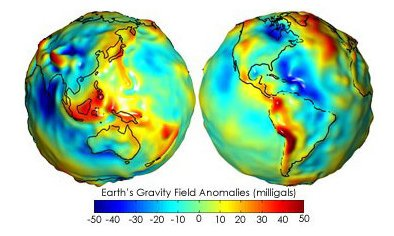
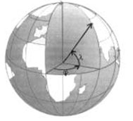
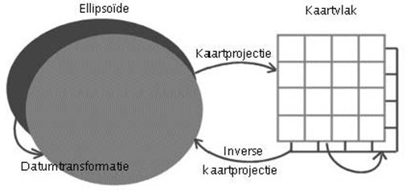
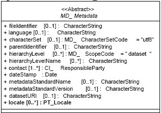
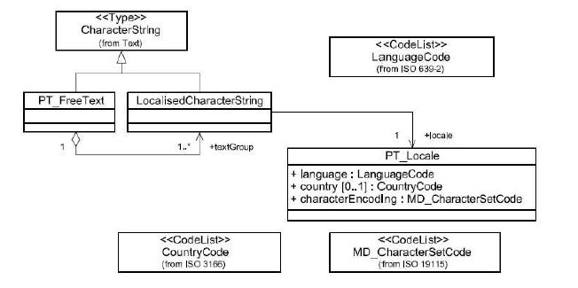

# Wat je ook moet weten

## Omgrenzende rechthoek

De geografische locatie kan op drie manieren worden beschreven, namelijk door een omgrenzende polygon(1), een omgrenzende rechthoek (2) of door een beschrijving (3). De omgrenzende rechthoek is het meest eenvoudig vast te leggen en is verplicht.

De omgrenzende rechthoek is de kleinste extent die mogelijk is waarmee de dataset goed weergegeven wordt.

De klasse omgrenzende rechthoek bestaat uit vier elementen die de hoeken van de omgrenzende rechthoek in decimale graden beschrijft. Als voorbeeld is de omgrenzende rechthoek van Nederland genomen.

De coördinaten dienen te worden weergegeven volgens referentiesysteem ETRS 89. Hiermee wordt het mogelijk gemaakt om op europees niveau data te doorzoeken

## Referentiesysteem

Bij ruimtelijke informatie zijn de gegevens gekoppeld aan locaties op aarde. Uiteraard is de vorm van de aarde het uitgangspunt voor coördinaatsystemen. Alle punten liggen namelijk op het gekromde aardoppervlak. Deze vorm is met al zijn bergen en dalen onmogelijk perfect wiskundig te beschrijven. 

Drie-dimensionale weergave van de geoïde waarop undulaties aangegeven zijn met kleur. Rood zijn plaatsen waar de geoïde hoger is, blauw waar hij lager is dan een perfecte ellipsoïde.

Een grove benadering is een bol, maar doordat de aarde bij de polen is afgeplat, is een driedimensionale ellips, een zogenaamde ellipsoïde, een betere benadering. Een ellipsoïde voor wereldwijd gebruik heeft tot doel het gehele aardoppervlak zo goed mogelijk te beschrijven. Er kunnen echter ook ellipsoïdes gedefinieerd worden met een iets ander middelpunt, een iets andere oriëntatie en een iets andere vorm, die zo goed mogelijk bij een bepaald gedeelte van het aardoppervlak passen. Voor Nederland is in de negentiende eeuw de Bessel-ellipsoïde gedefinieerd.
Een voorbeeld van een ellipsoïde is de WGS84-ellipsoïde, het referentiestelsel van het GPS-systeem. Coördinaten op zo’n wiskundig lichaam zijn geografische coördinaten.
Een punt op aarde wordt daarbij beschreven door een lengtegraad (lat) en een breedtegraad (lon) ten opzichte van het middelpunt van de bol of de ellipsoïde.

Lengte- en breedtegraden kunnen afgebeeld worden op een plat vlak met loodrechte coördinaatassen. Op de x-as staat dan meestal lengte, op de y-as de breedte. Elk blokje van de bovenstaande figuur wordt dan afgebeeld als een vierkantje. De werkelijkheid wordt daarbij vervormd, want de verticale lijnen (de meridianen) komen in de buurt van de polen steeds dichter bij elkaar te liggen. In het kaartvlak lijkt de afstand tussen bijvoorbeeld de vijfde en de zesde lengtegraad op 52o noorderbreedte (ter hoogte van Arnhem) even lang te zijn als de afstand tussen de vijfde en de zesde lengtegraad op 53o noorderbreedte (ter hoogte van Assen). In werkelijkheid verschillen deze afstanden echter meer dan anderhalve kilometer van elkaar. Kortom: in de kaart kunnen geen met de werkelijkheid overeenkomende maten voor hoeken, afstanden en oppervlaktes worden gemeten. Hoe groter het gebied is dat wordt afgebeeld, hoe groter de vervormingen in het kaartvlak zijn.

In de loop der tijd zijn er veel slimme methodes bedacht om geografische coördinaten naar coördinaten in een plat vlak om te rekenen, waarbij het doel steeds was de vervormingen zo klein mogelijk te maken. Deze rekenkundige methodes worden kaartprojecties genoemd. Welke kaartprojectie het meest geschikt is, hangt af van de toepassing en van de grootte, de vorm en de positie op aarde van het af te beelden gebied. Maar kaartprojecties zonder enigevervorming bestaan niet.

Coördinaten kunnen dus gegeven zijn op een ellipsoïde (meestal lengte en breedte), of in een kaartvlak (meestal x en y). Waar de omrekening van ellipsoïde naar kaartvlak kaartprojectie wordt genoemd, heet de omrekening tussen verschillende ellipsoïdes datumtransformatie.

In de Nederlandse situatie wordt veel gebruik gemaakt van de systemen RD (geprojecteerd),WGS84/ETRS89 (ellipsoïdisch) en UTM (geprojecteerd vanuit ED of vanuit WGS84/ETRS89). RD-coördinaten zijn in principe alleen in Nederland geldig.
Referentietext.jpg

## Geo gedeeld licentie

Wie geo-informatie van een ander gebruikt, moet weten of daarvoor voorwaarden gelden en zo ja welke voorwaarden dat zijn. De Nederlandse overheid wil overheidsinformatie zoveel mogelijk gratis en zonder gebruiksvoorwaarden beschikbaar stellen. Dat kan met behulp van de Publiek Domein Mark of met de Creative Commons Zero (CC0) Verklaring. Met beide gebruiksvoorwaarden zijn de gegevens door iedereen voor ieder doeleind te gebruiken. Het verschil is dat op gegevens met een CC0 Verklaring een auteurs-, databank of ander recht van kracht is. Met de CC0 verklaring wordt afstand gedaan van deze rechten.

Publiek Domein Mark
Gegevens die met de Publiek Domein Mark beschikbaar zijn gesteld, kunnen door iedereen voor alle doeleinden worden gebruikt. Ook naamsvermelding kan niet geëist worden. U vindt de tekst die bij de Publiek Domein Mark hoort op de site van Creative Commons; 
[http://creativecommons.org/publicdomain/mark/1.0/deed.nl](http://creativecommons.org/publicdomain/mark/1.0/deed.nl).

Creative Commons Zero
Als er auteursrecht en/of databankenrecht rust op gegevens, of als bij wet, besluit of verordening, het openbaarmaken van gegevens uitdrukkelijk is voorbehouden, is de Publiek Domein Mark niet mogelijk. Om ook in dit geval gegevens zonder verdere vereisten beschikbaar te stellen, kan de Creative Commons Zero Verklaring worden gebruikt. Met deze Verklaring geeft de eigenaar aan de geldende rechten niet te zullen uitoefenen. U vindt de tekst die bij de Creative Commons Zero Verklaring hoort op de site van Creative Commons; [http://creativecommons.org/publicdomain/zero/1.0/deed.nl](http://creativecommons.org/publicdomain/zero/1.0/deed.nl).

Geo Gedeeld
Kan de Publiek Domein Mark of de Creative Commons Zero Verklaring niet worden toegepast, dan is in het GI-beraad afgesproken dat u gebruik maakt van Geo Gedeeld. U vindt de juridische tekst, die bij Geo Gedeeld gebruiksvoorwaarden hoort op [http://geogedeeld.geonovum.nl](http://geogedeeld.geonovum.nl/).

Voor meer informatie over Gebruiksvoorwaarden voor geo-informatie kunt u contact opnemen met Geonovum of de veelgestelde vragen raadplegen.

## Optionele set metadata van data

Naast de verplichte kernset heeft de Nederlandse metadatastandaard voor geografie een optionele set metadata. Deze set bestaat uit een selectie van metadata-elementen uit ISO 19115, die nuttig zijn voor het beheer van geografische datasets en –series. Het is niet de volledige ISO19115 set. Als men meer metadata wil vastleggen als mogelijk met de verplichte kernset dan dient men bij voorkeur, om de interoperabiliteit te bevorderen, de benodigde elementen uit deze optionele set te kiezen. Van elk metadata element wordt achtereenvolgens gegeven: 

- de metadata naam (naam waaronder de metadata entiteit wordt aangeduid), 
- het ISO nummer, 
- de (eventueel specialiseerde) Nederlandse metadata element naam van het element in ISO 19115 en 
- de bijbehorende definitie.

## Meertaligheid metadata

Een dataset (serie) kan in meerdere talen worden beschreven conform de Nederlandse metadatastandaard voor geografie. Meertaligheid van metadata bij gebruik van codelijsten is mogelijk met behulp van zogenaamde codespaces. Voor vrije tekst is meertaligheid mogelijk door gebruik te maken van het element Locale uit de klasse MD_Metadata (ISO 19139). Door gebruik te maken van dit element kan metadata in meerdere talen worden vastgelegd. Het figuur geeft de klasse van MD_Metadata weer en het UML-schema van deze extensie op characterString weer.

De elementen met vrije tekst in het domein van CharacterString property type in ISO 19115 is bedoeld om tekstuele metadata-elementen te ondersteunen met meerdere velden voor dezelfde informatie in verschillende “locales”.Een "locale" heeft als domein “PT_Locale”, wat inhoud dat dit een combinatie is van een taal, land en een character codelijst (zie figuur), waarin de “localised” characterstring is weergegeven. Deze locale kan in elk vrije tekst element worden toegepast in ISO 19115. Dit is voldoende aangezien codelijsten zelf letterlijk vertaald kunnen worden. Onderstaand conceptueel schema is opgenomen in ISO19139, ook de benodigde data dictionary is opgenomen in ISO 19139.

## Object- en attribuutinformatie

In ISO 19115 is het niet mogelijk om object- en attribuutinformatie op te slaan. Aangezien het Nederlandse werkveld hier wel nadrukkelijk om heeft gevraagd, wordt daarom de volgende oplossing aangeboden om deze informatie wel op te kunnen slaan. Door ISO wordt een standaard betreffende de objectcatalogus aangeboden in ISO 19110 FeatureCatalogue. Per continent, land of sector kan vervolgens een profiel worden gedefinieerd op deze ISO 19110. Voorbeeld hiervan is ISO 19126, het Amerikaanse profiel op ISO 19110. Aangezien het definiëren van de objectcatalogus buiten de scope van het project valt, richt Geonovum zich enkel op de opslag van de object- en attribuutinformatie. Dit betekent dat niet alle verplichte elementen uit ISO 19110 worden opgeslagen. De elementen die opgeslagen kunnen worden zijn per object (featureType);

- de naam van het object;
- de definitie van het object;
-- per object de attribuutnamen (featureAttribute);
-- per attribuutnaam de definitie van de attribuutnaam.

Hierbij voorziet ISO 19110 in de gebruiksbehoefte van de klankbordgroep. Het is mogelijk om onderlinge relaties en bijvoorbeeld domeinen van de attributen aan te duiden in ISO 19110. Indien deze extra informatie wordt opgeslagen, dienen de voorwaarden van ISO 19110 in acht te worden genomen.

Deze methode is conform NEN3610. Indien een dataset volgens een sectormodel van NEN3610 is gecodeerd dan kan een objectcatalogus worden gegenereerd, aangezien in de sectormodellen ook de object- en attribuutinformatie (inclusief naam en definitie) is opgeslagen. Een objectcatalogus is een onderdeel van NEN3610.

## Richtlijnen voor sectoren

Sectoren in Nederland kunnen een eigen uitbreiding op het Nederlandse profiel ontwikkelen. Voorwaarde is dat de Nederlandse kernset metadata onderdeel is van het sectorale metadata profiel. Deze sectorale uitbreidingen dienen onderdeel te zijn van ISO 19115.

Ook is het mogelijk om de metadata standaard uit te breiden met bijvoorbeeld nieuwe klassen of bijvoorbeeld uitbreidingen van codelijsten. Geonovum raadt dit niet aan en adviseert om hierover contact op te nemen. Vaak zijn deze wensen onder te brengen in de bestaande set uit ISO 19115 zelf. Indien dit niet het geval is kan de procedure gevolgd worden die wordt voorgesteld in Annex C van ISO 19115.

Sectorale profielen dienen geregistreerd te worden bij Geonovum, als beherende instantie van de Nederlandse metadatastandaard voor geografie. Geonovum zal een formele naam van het profiel in overleg toekennen. Deze sectorspecifieke profielen leveren input voor het beheer van de Nederlandse metadatastandaard voor geografie.

## Metadata uitwisselen

### Metadata van datasets en dataset series

De metadata van datasets en dataset series wordt uitgewisseld in de encoding (XML) conform:

[http://schemas.opengis.net/iso/19139/20060504/](http://schemas.opengis.net/iso/19139/20060504/) (ISO 19115 metadata elementen)

Deze encoding is geschikt om tussen OGC catalogues (CSW) te kunnen uitwisselen. Voor de catalogues dient dan gebruik te worden gemaakt van de volgende schema’s:

- OGC Catalogue Service 2.0.2 [http://schemas.opengis.net/csw/2.0.2/](http://schemas.opengis.net/csw/2.0.2/)
- ISO Metadata Application Profile 1.0.0 [http://schemas.opengis.net/csw/2.0.2/profiles/apiso/1.0.0/](http://schemas.opengis.net/csw/2.0.2/profiles/apiso/1.0.0/)

Uitleg
OGC Catalog Service (2.0.2): Dit zijn de schema’s die de interfaces en het core model van de basis catalogue service definiëren.
ISO Application Metadata Profile (1.0.0): Dit schema is het basis schema van het ISO Application Profile voor de OGC Catalogue Service 2.0.2. Dit schema is verbonden met ISO 19139.

### Metadata van services

De metadata van services wordt uitgewisseld in de encoding (XML) conform:

[http://schemas.opengis.net/csw/2.0.2/profiles/apiso/1.0.0/](http://schemas.opengis.net/csw/2.0.2/profiles/apiso/1.0.0/) (ISO 19119 metadata elementen)
Deze encoding die tevens gebruik maakt van:
[http://schemas.opengis.net/iso/19139/20060504/](http://schemas.opengis.net/iso/19139/20060504/) (ISO 19115 metadata elementen)
is geschikt om tussen OGC catalogues (CSW) te kunnen uitwisselen.

Een andere manier is om het capabilities document dat verplicht bij elke OGC service aanwezig moet zijn gebruikt 
kan worden om een deel van de metadata elementen te beschrijven. In de praktijkrichtlijn voor het publiceren van 
geo dataservices is een mapping gemaakt van de capabilities documenten voor WMS en WFS naar 
[http://schemas.opengis.net/csw/2.0.2/profiles/apiso/1.0.0/](http://schemas.opengis.net/csw/2.0.2/profiles/apiso/1.0.0/). 
Hierdoor kan de capabilities ook gebruikt worden als encoding. De meeste catalogues (gaan) kunnen capabilities harvesten.

### Metadata van Object- en attribuutinformatie

Metadata voor Object- en attribuutinformatie wordt uitgewisseld in de encoding (XML) conform:

[http://www.isotc211.org/2005/gfc/gfc.xsd](http://www.isotc211.org/2005/gfc/gfc.xsd) (ISO 19110 metadata elementen)
is geschikt om tussen OGC catalogues (CSW) te kunnen uitwisselen.