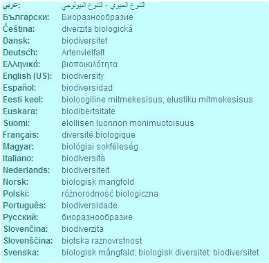
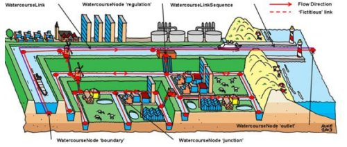

# Metadata elementen

Dit hoofdstuk beschrijft enkele verplichte elementen van het Nederlands profiel iets uitgebreider dan in de specificatie.

## Titel van de bron

De resource title is de naam van de service, ook wel titel van de service genoemd. Het is niet de technische naam van de service.


Het doel van dit element is de service voldoende te identificeren voor de gebruiker. Een meer uitgebreide omschrijving van de service kan gegeven worden in een ander veld, namelijk resource abstract. Wanneer er verschillende versies van een service in de meta-informatie opgenomen moeten worden, is het aan te raden om de verschillende versienummers op een gelijke wijze in de service naam te verwerken. Aanbevolen schrijfwijze voor dit element is:


(projectkenmerk) onderwerp (locatiekenmerk) (jaar) (versie)
Hierbij zijn de onderdelen tussen haakjes niet verplicht, de andere wel.


Voorbeeld;
Nieuwe kaart van Nederland
WMS bos


Capability element;
/WMT_MS_Capabilities/Title

!{WMS}(images/WMS.jpg)

## Samenvatting

De resource abstract is de samenvatting van de inhoud van de service.
In dit element kan een meer uitgebreide beschrijving van de service gegeven worden. Een service kan samengesteld zijn uit verschillende datasets. Hierdoor kan de samenvatting afwijken van de samenvatting van een dataset.


Voorbeeld;
De Nieuwe Kaart van Nederland is een totaaloverzicht van nieuwe ruimtelijke ontwikkelingen

Capability element;
/WMT_MS_Capabilities/Abstract


## Hiërarchieniveau

Het element resource type geeft aan waarop de metadata betrekking heeft. Voor dataservices is dat service, bij metadata voor data kan dat dataset of serie zijn. Deze waarde kan als default gehanteerd worden.

Resource type kan de volgende waarde bevatten;

| Naam	| Engelse naam	| Beschrijving |
| --- | --- | --- |
| service	| service	| Informatie heeft betrekking op de service |


## Hiërarchieniveau naam

Het element hiërarchieniveau naam bevat de naam van het hiërarchieniveau waarvoor de metadata is beschreven.

Dit element is conditioneel. Het is verplicht als Hiërarchieniveau niet gelijk is aan dataset. Indien het hierarchyniveau dataset is dient dit veld niet ingevuld te worden.
Toepassing van metadata op dataset series maak het gebruikers van de metadata mogelijk om op een hoger niveau dan individuele datasets data te zoeken. Metadata van dataset series is geschikt voor het zoeken op globale karakteristieken van beschikbare data, maar niet voor diepgaand onderzoek naar de kwaliteit van specifieke datasets. Hiervoor is metadata van datasets noodzakelijk. De figuur hieronder geeft een schematische weergave van de relatie tussen de metadata van dataset series en datasets zelf weer. De hiërarchische relatie tussen een dataset en dataset serie is altijd van verticale aard.


De kernset van het Nederlands metadata profiel voor geografie geldt niet alleen voor geografische datasets, maar ook voor dataset series. Volgens ISO 19115 is een dataset serie een verzameling geografische data die gelijke karakteristieken hebben ten aanzien van het thema, de resolutie en/of methodologie. Veelal geven dataproducenten aan of er sprake is van een dataset serie.

Een voorbeeld van een dataset serie is:

AHN Nederland

## Karakterset van de bron

Dit metadata element geeft de gebruikte karakterset aan. Dit zal bijna altijd ‘utf8’ zijn. De karakterset die gecodeerd is volgens de ISO/IEC 10646 standaard, zie tabel hieronder bij beschrijving, voldoet voor niet INSPIRE datasets. Utf8 en utf16 voldoen aan deze standaard.

Voor INSPIRE verplicht als voor de uitwisseling van de bron geen GML wordt gebruikt en de gebruikte karakterset geen utf8 is. Voor niet INSPIRE datasets is het verplicht als de waarde niet voldoet aan de ISO/IEC 10646 standaard.

in deze gevallen een van onderstaande waardes kiezen.


 

Naam	Engelse naam	Beschrijving
ucs2	ucs2	16-bit fixed size Universal Character Set, based on ISO/IEC 10646.
Ucs4	ucs4	32-bit fixed size Universal Character Set, based on ISO/IEC 10646.
Utf7	utf7	7-bit variable size UCS Transfer Format, based on ISO/IEC 10646.
Utf8	utf8	8-bit variable size UCS Transfer Format, based on ISO/IEC 10646.
Utf16	utf16	16-bit variable size UCS Transfer Format, based on ISO/IEC 10646.
8859part1	8859part1	ISO/IEC 8859-1, Information technology – 8-bit single-byte coded graphic character sets – Part 1: Latin alphabet No. 1.
8859part2	8859part2	ISO/IEC 8859-2, Information technology – 8-bit single-byte coded graphic character sets – Part 2: Latin alphabet No. 2.
8859part3	8859part3	ISO/IEC 8859-3, Information technology – 8-bit single-byte coded graphic character sets – Part 3: Latin alphabet No. 3.
8859part4	8859part4	ISO/IEC 8859-4, Information technology – 8-bit single-byte coded graphic character sets – Part 4: Latin alphabet No. 4.
8859part5	8859part5	ISO/IEC 8859-5, Information technology – 8-bit single-byte coded graphic character sets – Part 5: Latin/Cyrillic alphabet.
8859part6	8859part6	ISO/IEC 8859-6, Information technology – 8-bit single-byte coded graphic character sets – Part 6: Latin/Arabic alphabet.
8859part7	8859part7	ISO/IEC 8859-7, Information technology – 8-bit single-byte coded graphic character sets – Part 7: Latin/Greek alphabet.
8859part8	8859part8	ISO/IEC 8859-8, Information technology – 8-bit single-byte coded graphic character sets – Part 8: Latin/Hebrew alphabet.
8859part9	8859part9	ISO/IEC 8859-9, Information technology – 8-bit single-byte coded graphic character sets – Part 9: Latin alphabet No. 5.
8859part10	8859part10	ISO/IEC 8859-10, Information technology – 8-bit single-byte coded graphic character sets –Part 10: Latin alphabet No. 6.
8859part11	8859part11	ISO/IEC 8859-11, Information technology – 8-bit single-byte coded graphic character sets –Part 11: Latin/Thai alphabet.
(gereserveerd voor toekomstig gebruik)	(reserved for future use)	a future ISO/IEC 8-bit single-byte coded graphic character set (e.g. possibly 8859-12).
8859part13	8859part13	ISO/IEC 8859-13, Information technology – 8-bit single-byte coded graphic character sets –Part 13: Latin alphabet No. 7.
8859part14	8859part14	-ISO/IEC 8859-14, Information technology – 8-bit single-byte coded graphic character sets – Part 14: Latin alphabet No. 8 (Celtic).
8859part15	8859part15	ISO/IEC 8859-15, Information technology – 8-bit single-byte coded graphic character sets –Part 15: Latin alphabet No. 9.
8859part16	8859part16	ISO/IEC 8859-16, Information technology – 8-bit single-byte coded graphic character sets –Part 16: Latin alphabet No. 10.
Jis	jis	Japanese code set used for electronic transmission.
shiftJIS	shiftJIS	Japanese code set used on MS-DOS based machines.
eucJP	eucJP	Japanese code set used on UNIX based machines.
usAscii	usAscii	United states ASCII code set (ISO 646 US).
Ebcdic	ebcdic	Ibm mainframe code set.
eucKR	eucKR	Korean code set.
Big5	big5	Traditional Chinese code set used in Taiwan, Hong Kong of China and other areas.
GB2312	GB2312	Simplified Chinese code set.

## Distributie

### Naam distributie formaat

Dit element bevat de naam van het distributie formaat van de dataset. Dit element is conditioneel in dit profiel. Het is alleen verplicht als de dataset een INSPIRE bron is.  De presiese informatie over hoe de naamgeving van het applicatie schema is, is te vinden in de INSPIRE dataspecificaties in de paragraaf genaamd Encoding.


Voorbeeld:

Hydrography GML application schema

### Versie distributie formaat

Dit element bevat de versie van het distributie formaat van de dataset.

Dit element is conditioneel in dit profiel. Het is alleen verplicht als de dataset een INSPIRE bron is.  Deze informatie is te vinden in de INSPIRE dataspecificaties in de paragraaf genaamd Encoding.


Voorbeeld:

version 3.0; GML, version 3.2.1

### Specificatie distributie formaat

Dit element bevat de specificatie van het distributie formaat van de dataset.

Dit element is conditioneel in dit profiel. Het is alleen verplicht als de dataset een INSPIRE bron is.  De presiese informatie is te vinden in de INSPIRE dataspecificaties in de paragraaf genaamd Encoding.


Voorbeeld:

D2.8.I.8 Data Specification on Hydrography – Guidelines

## resource locator 

Het element resource locator bevat de valide URL voor on-line toegang tot de service.


Dit element is conditioneel. Als er een link naar de service beschikbaar is, is de resource locator een verplicht element. Voor bijvoorbeeld services waar een restrictieve toegang voor geldt kan dit element niet ingevuld worden.

Dit element wordt ook in de metadata van de data opgenomen in het element URL waardoor de link naar de service wordt gelegd.


Voorbeeld;
http://www.dinoservices.nl/wms/dinomap/M09M0817

## Connect Point Linkage

Het element Connect Point Linkage beschrijft het netwerkadres van de service instance.


Dit element heeft hetzelfde doel als Resource Locator. Doordat ISO 19115 en ISO 19119 niet op dit punt met elkaar zijn afgestemd zijn hier twee verschillende metadata elementen (met dezelfde doelstelling) en verschillende encoding (ISO 19139 en CSW ISO Metadata AP) ontstaan.


Voorbeeld;
http://www.dinoservices.nl/wms/dinomap/M09M0817

## Coupled resource

De coupled resource bevat een link naar informatie (metadata) over de data die in de service beschikbaar wordt gesteld. Het bevat een valide URL. Dit element is conditioneel. Het is verplicht als er links naar de datasets waarop de service opereert beschikbaar zijn. Voor dataservices is het dus verplicht.


Voor een WMS is het, volgens het Nederlands profiel voor WMS, verplicht een MetadataURL bij elke layer op te nemen. De MetadataURL wordt in metadata voor services in het element coupled resource opgenomen. Deze MetadataURL verwijst naar de XML van de metadata van de data in de layer.
In het geval dat de layer een dataset ontsluit, wordt verwezen naar de metadata XML van die dataset. Als een dataset meerdere malen in dezelfde service ontsloten wordt wordt voor elke layer een verwijzing naar de metadata XML van die dataset opgenomen.
Ontsluit een service meerdere datasets dan komen er meerdere metadataURL’s voor die naar de verschillende metadata XML’s verwijzen.


Het is ook mogelijk om naar het metedatarecord in een catalogus te verwijzen die de metadata van de dataset ontsluit.


Voorbeeld;
http://88.198.70.50/geonetwork/srv/nl/iso19139.xml?id=21628


## Scoped Name

De ScopedName is de naam van de layer in de WMS of de featureTypeName van de WFS. De ScopedName is verplicht voor WMS, WFS en WCS.


In ISO AP 1.0 is de klasse SV_CoupledResource uitgebreid met een sub element (zie sectie 7.2.2.2 in de CSW ISO AP profiel document).


Scopedname.jpg


Deze uitbreiding is ook in ISO 19119 gerelateerde XML schemas opgenomen. Daarmee is het mogelijk de precieze link tussen een operatie (geïdentificeerd door zijn naam), een dataset instance (geïdentificeerd door zijn resource identifier) en optioneel, ScopedName (layer name (WMS) of featureTypeName (WFS)) te beschrijven


In versie 1.2 van dit profiel is dit element optioneel geworden.


Voorbeeld;
bos


Capabilities element:
/WMT_MS_Capabilities/Capability/Layer/Layer/bos

## Coupling Type

het element CouplingType definieert het type “koppeling” tussen een service instance en een dataset. Voor een WMS of WFS geldt de waarde 'tight'. Deze waarde kan dan ook als default gehanteerd worden.


De mogelijke waarden zijn:
Naam	Beschrijving
loose	Een service instance die niet gekoppeld is met een specifieke dataset of dataset serie. Looselycoupled services zouden een associatie kunnen hebben met een datatype door de serviceType definitie. Metadata voor data wordt niet geleverd in de service metadata.
mixed	Een service instance die gekoppeld is met een specifieke dataset of dataset serie. Service metadata dienen zowel de service als geografische dataset te beschrijven (door middel van ISO 19115). Daarnaast kan deze service instance ook gebruikt worden met externe data (data die niet wordt beschreven door de operatesOn klasse).
tight	Een service instance die gekoppeld is met een specifieke dataset of dataset serie. Service metadata dienen zowel de service als geografische dataset te beschrijven (door middel van ISO 19115).

## Spatial data service type

Het element spatial data service type bevat het type van de service.


De implementing rules van INSPIRE verplichten het gebruik van de waardes uit Annex B.3. Deze informatie zal gebruikt worden voor de service type attribuut van de klasse SV_ServiceIdentification.


Het data type uit deze klasse is echter GenericName. Dus de waardes uit B3 kunnen niet gebruikt worden omdat dat een codelijst is. Ook is er niet een rechtstreekse mapping tussen de INSPIRE service types en de waardes van het servicetype atribuut van de klasse SV_ServiceIdentification. Op lange termijn zal er een register beschikbaar komen die de ISO191119 waardes koppelt aan de verschillende INSPIRE service types.
Binnen Nederland geldt voor dit metadata element een restrictiever domein dan in ISO 19119:2005, namelijk een codelijst. Doel hiervan is een uniforme naamgeving voor het serviceType, zodat alle serviceTypes gevonden kunnen worden. In deze codelijst SV_ServiceTypeCode staan alle mogelijke services types met een gepubliceerde standaard specificatie weergegeven.


Mogelijke waarden voor service type zijn;
Servicetypeservices.jpg 

Voorbeeld;
OGC:WMS


Capabilities element;
/WMT_MS_Capabilities/Name

### Service Type Version

Service Type Version is de versie van de specificatie van de service. Niet een implementatie versie van de software die geïmplementeerd. Als scheidingsteken tussen de cijfers dient een punt gebruikt te worden. Door het opnemen van het versienummer is bekend welke operaties er mogelijk zijn en hoeven deze niet apart beschreven te worden.


In versie 1.2 van dit profiel is dit element niet meer opgenomen.


Voorbeeld;
1.1.1


Capabilities element;
/WMT_MS_Capabilities/@version

## Operation Name

Het element operation name geeft de naam van de operatie weer. Aangezien het serviceType en serviceTypeVersion verplicht zijn, kunnen de bijbehorende verplichte operaties (OperationName) en parameters (SV_Parameter) worden afgeleid. Deze attribuutwaarden kunnen als default door de applicatie worden toegevoegd. Daarnaast kunnen optionele waarden handmatig worden toegevoegd.


Voorbeeld;
getMap


Capabilities element;
/WMT_MS_Capabilities/Capability/Request/*

## DCP

Dit element bevat het Distributed Computing Platforms waarop de operatie is geïmplementeerd. INSPIRE gaat van de default waarde WebServices uit. Deze waarde is opgenomen in de codelijst DCPlist . De huidige attribuutwaarden worden verwijderd en ongeldig verklaard.


Mogelijke waarden zijn;
WebServices

Capabilities element;
/WMT_MS_Capabilities/Capability/Request/*/DCPType/HTTP/*


## Trefwoord

Het element keyword value bevat in het algemeen gebruikte woorden of geformaliseerde zinnen om een service te beschrijven. Dit kunnen trefwoorden uit een thesaurus zijn maar ook zelf gedefinieerde trefwoorden. Er kunnen meerdere trefwoorden worden gebruikt, maar het is geen uitputtende lijst.

Voor INSPIRE services dient er op z’n minst één keyword de categorie of subcategorie te bevatten uit deel D.4 van de commissie regulation 1205/2008, zie bijlage 1. Daarnaast kunnen er andere keywords met bijvoorbeeld het thema worden opgenomen. In http://www.eionet.europa.eu/gemet/inspire_themes zijn de thema’s van INSPIRE opgenomen.[1]


Voor WMS kan de waarde infoMapAccessService worden toegepast. Voor WFS dient er op z’n minst infoFeatureAccessService aangegeven te worden. Dit kan default worden ingevuld


Voorbeeld;
infoMapAccessService


Capabilities element;
/WFS_Capabilites/ServiceIdentification/*/Keyword/*

### Thesaurus

Een thesaurus is een lijst met trefwoorden die ontleend zijn aan het dagelijks taalgebruik van professionals. In de thesaurus wordt de betekenis van trefwoorden vastgelegd door relaties te benoemen met synonieme begrippen, bredere, specifiekere en verwante begrippen en door een uitleg bij de trefwoorden. Voor INSPIRE wordt gebruik gemaakt van de GEMET thesaurus. Daarin worden de INSPIRE thema’s opgenomen. Zie  http://www.eionet.europa.eu/gemet/inspire_themes 


Thesaurus een conditioneel element. Het thesaurus element is verplicht als een trefwoord uit een thesaurus afkomstig is zoals in ieder geval voor de INSPIRE thema’s. Het bevat de naam van de thesaurus waar het trefwoord uit afkomstig is.


Voorbeeld:
“GEMET Thesaurus version 1.0”



### Thesaurus datum

Het bevat de creatie-, publicatie-, of wijzigingsdatum, van de thesaurus waar het trefwoord uit afkomstig is. Het formaat van de datum is JJJJ-MM-DD (met streepjes).

Dit is een conditioneel element. Het is verplicht als een trefwoord uit een thesaurus afkomstig is zoals in ieder geval voor de INSPIRE thema’s.


Voorbeeld:
2009-05-15

### Thesaurus datum type

Het thesaurus datum type element bevat het type gebeurtenis waar de datum betrekking op heeft.


Dit is een conditioneel element. Het is verplicht als een trefwoord uit een thesaurus afkomstig is zoals in ieder geval voor de INSPIRE thema’s.

Mogelijke waarden zijn;


| Naam |	Engelse naam |	Beschrijving |
| --- | --- | --- |
| creatie | 	creation |	Datum waarop de dataset of dataset serie is gecreëerd. |
| publicatie | publication | Publicatie datum waarop de dataset of dataset serie is gepubliceerd. |
| revisie | revision | Datum waarop de dataset of dataset serie is gecontroleerd, verbeterd of is gewijzigd. |


Voorbeeld;
publication

## Geographic location

Dit element is conditioneel. Het is verplicht als er data aan de service is gekoppeld. (service is dan tight of mixed coupled service).

De geographic location, ofwel geografische locatie kan op drie manier worden beschreven: 
(1) door een bounding polygon, 
(2) door een bounding box of 
(3) door een beschrijving.


De bounding box is de kleinste extent die mogelijk is waarmee de map goed weergegeven wordt. De coördinaten dienen te worden weergegeven volgens referentiesysteem WGS 84.

### Minimum x/y, maximum x/y-coördinaten

Deze elementen bevatten de meest westelijke, zuidelijk, oostelijk en noordelijke coördinaten uit de dekking van de dataset weergegeven in longitude en lattitude in decimale graden (noord en oost als positieve waarden). De coördinaten dienen te worden weergegeven volgens referentiesysteem WGS84. Als de coordinaten niet (in WGS 84) bekend zijn kan de volgende tool ze opzoeken en/of omrekenen naar WGS 84

Voorbeeld;
2.50 

## Temporele Referentie

De Temporal Reference heeft betrekking op de periode waar de service betrekking op heeft of de datum van voltooing, publicatie of datum laatste wijziging.Op zijn minst één temporele referentie is verplicht. Om op ISO 19115 aan te sluiten moet ’in ieder geval één van de volgende elementen worden vastgelegd; Creatie-, publicatie-, of revisiedatum van de service. Aanbevolen wordt om de publicatie datum op te nemen.


Temporal extent
Periode waarop de data betrekking heeft. Dit kan een tijdsinterval zijn maar ook een datum. De overall tijdsperiode gedekt door de inhoud van de service kan een samenstelling zijn van een of meer waarden. Het formaat van de datum is JJJJ-MM- DD (met streepjes) of JJJJ-MM-DDTUU:MM:SS (met streepjes T van time en dubbele punt).


Voorbeeld;
From 1977-03-10T11:45:30 to 2005-01-15T09:10:00


Hieronder volgen de verschillende vormen van datum.


Date of publication
Datum waarop de service gepubliceerd is. Het formaat van de datum is JJJJ-MM-DD (met streepjes) of JJJJ-MM-DDTUU:MM:SS (met streepjes T van time en dubbele punt).


Voorbeeld;
2007-09-15 or 2007-11-15T11:15:00


Date of last revision
Datum waarop de service gewijzigd is. In ISO19115 kan men meerdere wijzigingsdata opnemen. De INSPIRE datum is de recentste. Het formaat van de datum is JJJJ-MM-DD (met streepjes) of JJJJ-MM-DDTUU:MM:SS (met streepjes T van time en dubbele punt).


Voorbeeld;
2007-09-15 or 2007-11-15T11:15:00


Date of creation
Datum waarop de service voltooid is. Het formaat van de datum is JJJJ-MM-DD (met streepjes) of JJJJ-MM-DDTUU:MM:SS (met streepjes T van time en dubbele punt).


Voorbeeld;
2007-09-15 or 2007-11-15T11:15:00


## spatial resolution 

het element spatial resolution geeft de mate van detail of resolutie aan. Dit element is conditioneel. Als de service een restrictie is op de ruimtelijke resolutie van de service dan is dit element verplicht. Bijvoorbeeld een classificatieproces werkt niet goed op een lage resolutie image of een coördinaat transformatie is niet nauwkeuriger dan 1m resolutie. Het kan in twee elementen worden vastgelegd. Men gebruikt of de equivalentScale of de distance. De elementen kunnen twee keer voorkomen, hiermee wordt een interval aangegeven.


equivalentScale
Het element bevat de mate van detail aangeduid als schaalaanduiding van een vergelijkbare hardcopy kaart 
Voorbeeld; 
50000


Distance
Het element bevat de resolutie. De afstand wordt in meters opgenomen.


In versie 1.2 van dit profiel is dit element niet meer opgenomen.


Voorbeeld;
3

## Conformiteitindicatie met de specificatie

Met de 'conformiteitindicatie met de specificatie' kan worden weergegeven of de service wel of niet conform de INSPIRE specificatie.  Dit element is conditioneel in dit profiel. Het is alleen verplicht als de service een INSPIRE bron is.

Voorbeeld:
TRUE

### Verklaring

De verklaring bevat de betekenis van de conformiteit. Aangegeven kan worden op welke punten de dataset wel of niet conform een informatiemodel of dataspecificatie is.


Dit element is conditioneel. Het is alleen verplicht als de dataset een INSPIRE bron is of als de informatie is gemodelleerd volgens een specifiek informatiemodel. 

Voorbeeld:
De hier gehanteerde domeinen wijken af van de domeinen uit de dataspecificaties van INSPIRE

### Specificatie

Het element specificatie bevat de titel van de specificatie of richtlijnen of informatiemodel waar de dataset conform aan dient te zijn.


Dit element is conditioneel in dit profiel. Het is alleen verplicht als de dataset een INSPIRE bron is of als de informatie is gemodelleerd volgens een specifiek informatie model.


Voorbeeld:
IMRO2008
INSPIRE D2.8.I.5 Data Specification on Addresses

### Specificatie datum

Het metadata element specficatie datum bevat de datum van de specificatie of richtlijnen of informatiemodel waar de dataset conform aan dient te zijn. Het formaat van de datum is JJJJ-MM-DD (met streepjes). In specificatie datum type wordt aangegeven of het om de creatie-, publicatie- of herzieningsdatum gaat.


Dit element is conditioneel in dit profiel. Het is alleen verplicht als de dataset een INSPIRE bron is of als de informatie is gemodelleerd volgens een specifiek informatie model.


Voorbeeld:
2009-05-15

### Specificatie datum type

De specificatie datum type bevat het type gebeurtenis waar de datum betrekking op heeft.


Dit element is conditioneel in dit profiel. Het is alleen verplicht als de dataset een INSPIRE bron is of als de informatie is gemodelleerd volgens een specifiek informatie model.

## Topologische samenhang

Dit element is conditioneel in dit profiel. Het is verplicht voor INSPIRE datasets als voor netwerken de aansluiting van hartlijnen niet is verzekerd. Het bevat de tolerantie waarmee de topologische samenhang is vastgelegd


Voorbeeld:

3



### Type waarde

Het bevat de meeteenheid waarmee de topologische samenhang is vastgelegd.


Dit element is conditioneel in dit profiel. Het is verplicht voor INSPIRE datasets als voor netwerken de aansluiting van hartlijnen niet is verzekerd.


Voorbeeld:

cm

## Juridische toegangsrestricties

Juridische toegansrestricties is het metadata element dat de toegangseisen bevat die er zorg voor dragen dat privacy of intellectueel eigendom gewaarborgd zijn en elke andere speciale beperkingen voor het verkrijgen van de metadata of data.


Het is verplicht op zijn minst één van de drie elementen juridische toegangsrestricties, overige beperkingen, veiligheidsrestricties op te nemen. De Nederlandse overheid wil overheidsinformatie zoveel mogelijk gratis en zonder gebruiksvoorwaarden beschikbaar stellen. Dat kan met behulp van de Publiek Domein Mark of met de Creative Commons Zero (CC0) Verklaring. Met beide gebruiksvoorwaarden zijn de gegevens door iedereen voor ieder doeleind te gebruiken. Om dit toe te passen kiest men hier voor de waarde "anders".  De licentie wordt in het element 2.4.34_Overige_beperkingen opgenomen. In 2.6.3 Gebruiksvoorwaarden  is uitgewerkt hoe gebruiksvoorwaarden en public domein mark toe te passen
Mogelijke waarden zijn;

| Naam  	Engelse naam	Beschrijving
| copyright 	copyright	Exclusief recht voor publicatie, productie, of verkoop van rechten op een literair, theater, muzikaal of artistiek werk, of op het gebruik van een commerciële druk of label, toegekend bij wet voor een specifieke periode of tijd aan een auteur, componist, artiest of distributeur.
| patent	patent	Overheid heeft een exclusief recht toegekend om een uitvinding te maken, verkopen, gebruiken of in licentie uit te geven.
| patent in wording 	patentPending	Geproduceerde of verkochte informatie wachtend op een patent.
| merknaam 	trademark	Een naam, symbool of ander object om een product te identificeren, wat officieel geregistreerd is en gebruik wettelijk is voorbehouden aan de eigenaar of fabrikant.
| licentie	license	Formele toestemming of iets te doen.
| intellectueel eigendom 	intellectualPropertyRights	Recht op een financieel voordeel van en controle hebben op de distributie van een niet tastbaar eigendom wat het resultaat is van creativiteit.
| niet toegankelijk 	restricted	Verbod op distributie en gebruik.
| anders 	otherRestrictions	Restrictie niet opgenomen in lijst

### Overige beperkingen 

Dit element bevat andere restricties (dan toegangsrestricties en veiligheidsresricties) en vereisten voor toegang en gebruik van de dataset.

Het is verplicht op zijn minst één van de drie elementen juridische toegangsrestricties, overige beperkingen, veiligheidsrestricties op te nemen.


De volgende invulinstructies worden gehanteerd om de gebruiksvoorwaarden van public domain, CC0, CC-BY en Geo Gedeeld op te nemen in de metadata:


• (Juridische) Toegangsrestricties: 
De waarde “Anders” invullen waardoor overige beperkingen verplicht wordt. Ook bij geen toegangrestricties!

• Overige beperkingen: Dit veld is te gebruiken om de licentie van Public domain, Creative Commons Publieke Domein Verklaring (CC0), Creative Commons naamsvermelding (CC-BY) of Geo Gedeeld in te vullen. Dit element kan men meerdere keren in de metadata opnemen. Voor het opnemen van onderstaande beperkingen is het element “overige beperkingen” twee maal nodig.

o Bij geen gebruiksbeperkingen het volgende invullen in twee verschillende elementen:

Overige beperkingen: Geen beperkingen 
Overige beperkingen: http://creativecommons.org/publicdomain/mark/1.0/deed.nl

o Bij Publieke Domein Verklaring (CC0) het volgende invullen in twee verschillende elementen:

Overige beperkingen: Geen beperkingen 
Overige beperkingen: http://creativecommons.org/publicdomain/zero/1.0/deed.nl

o Bij Creative commons naamsvermelding(CC-BY) het volgende invullen in twee verschillende elementen:

Overige beperkingen: Naamsvermelding verplicht, organisatienaam 
Overige beperkingen: http://creativecommons.org/licenses/by/3.0/nl/

o Bij gebruiksbeperkingen vastgelegd met geogedeeld het volgende invullen in twee verschillende elementen:

Overige beperkingen: Geo Gedeeld licentie 
Overige beperkingen: Verwijzing naar de URL van de licentie http://

```xml
<gmd:resourceConstraints>
  <gmd:MD_LegalConstraints>
    <gmd:useLimitation>
      <gco:CharacterString>Geen gebruiksbeperking</gco:CharacterString>
    </gmd:useLimitation>
    <gmd:accessConstraints>
      <gmd:MD_RestrictionCode 
        codeList="http://www.isotc211.org/2005/resources/codeList.xml#MD_RestrictionCode"
        codeListValue="otherRestrictions"/>
    </gmd:accessConstraints>
    <gmd:otherConstraints>
       <gco:CharacterString> Geen beperkingen </gco:CharacterString>
    </gmd:otherConstraints>
    <gmd:otherConstraints>
       <gco:CharacterString>
         http://creativecommons.org/publicdomain/mark/1.0/deed.nl
       </gco:CharacterString>
    </gmd:otherConstraints>
  </gmd:MD_LegalConstraints>
</gmd:resourceConstraints>
```

## Veiligheidsrestricties

Dit element bevat de soort restrictie op de dataset.


Het is verplicht op zijn minst één van de drie elementen juridische toegangsrestricties, overige beperkingen, veiligheidsrestricties op te nemen. Als er geen beperkingen zijn dient men dat bij overige beperkingen aan te geven. In 2.6.3 Gebruiksvoorwaarden is uitgewerkt hoe gebruiksvoorwaarden en public domein mark toe te passen. De licentie wordt in het element overige beperkingen opgenomen. 

Mogelijke waarden zijn;
Naam	Engelse naam	Beschrijving
vrij toegankelijk 	unclassified	Beschikbaar voor algemene ontsluiting.
niet toegankelijk 

restricted	Niet geschikt voor algemene ontsluiting.
vertrouwelijk 	confidential	Beschikbaar voor personen die vertrouwd kan omgaan met de
informatie.
geheim 	secret	Dient geheim en verborgen te worden gehouden voor iedereen
behalve een geselecteerde groep personen.
zeer geheim	topSecret	Hoogste geheimhouding vereist.
 

## Gebruiksbeperkingen

Gebruiksbeperkingen bevat toepassingen waarvoor de dataset niet geschikt is, maar kan ook prijsinformatie voor het gebruik van de dataset bevatten.


De volgende voorbeelden zijn praktijkvoorbeelden, deze disclaimers kunnen beter opgenomen worden bij overige beperkingen.


Verkeerde voorbeelden: 
1. Ten behoeve van naamsvermelding van de Nieuwe Kaart van Nederland onder de Creative Common Licentie zijn twee opties mogelijk.1. Opname in ongewijzigde vorm indien (een gedeelte van) de Nieuwe Kaart van Nederland in ongewijzigde vorm wordt overgenomen, dan wordt de kaart in feite gekopieerd. De volgende naamsvermelding en bijbehorende licentie (voor toekomstige her-gebruikers) is dan van toepassing:Bron: De Nieuwe Kaart van Nederland, Nirov, Den Haag / Creative Commons - Naamsvermelding 2.5 Nederland2. Opname in bewerkte / afgeleide vormVoor de Nieuwe Kaart is dan alleennaamsvermelding van toepassing. In feite is nu een eigen kaart gemaakt (op basis van de Nieuwe Kaart van Nederland) waarvan zelf bepaald wordt onder welke licentie deze wordt uitgegeven. Met onderstaande naamsvermelding wordt het gebruik van de Nieuwe Kaart afgedekt:Bron: De Nieuwe Kaart van Nederland, Nirov, Den HaagMeer informatie: www.creativecommons.org
2. http://dinolks01.nitg.tno.nl/dinoLks/about/legal/terms.jsp
3. Zie http://www.rijkswaterstaat.nl/apps/geoservices/legal/NWB_disclaimer.html
4. geen - none

Correcte voorbeelden: 
- Niet te gebruiken voor navigatie 
- Voor gebruik van deze dataset wordt een vergoeding van 100 euro gevraagd

## Verantwoordelijke organisatie bron

Verantwoordelijke organisatie bron is het metadata element waarin de de identificatie van de verantwoordelijke organisatie wordt aangegeven. Van de organisatie wordt de volledige organisatie naam vastgelegd behorende bij een bepaalde rol.


De naam van de organisatie wordt altijd voluit geschreven en in volgorde van hiërarchie. De afkorting kan toegevoegd worden aan de organisatienaam. Voor de correcte overheidsnamen zie: http://www.overheid.nl/overheidsorganisaties.


Voorbeelden:
1. Nederlands Instituut voor Ruimtelijke Ordening en Volkshuisvesting (Nirov)
2. Nederlandse organisatie voor toegepast-natuurwetenschappelijk onderzoek (TNO)
3. Rijkswaterstaat Data en ICT Dienst (RWS DID) 
4. Planbureau voor de Leefomgeving (PBL)

### Verantwoordelijke organisatie bron: e-mail

Dit element bevat het e-mail adres van de verantwoordelijke organisatie van de bron. Dit kan een persoonlijk e-mailadres zijn , maar ook een algemeen e-mailadres of een e-mailadres van een loket.


Voorbeelden:
1. info@nieuwekaart.nl
2. dinoloket@tno.nl
3. geoloket@pbl.nl

### Verantwoordelijke organisatie bron: rol

De rol van de verantwoordelijke organisatie bron beschrijft op welke manier een bepaalde organisatie betrokken is bij een dataset. Er kunnen meerdere organisaties met verschillende rollen bij een dataset betrokken zijn. Een organisatie kan ook meerdere rollen hebben.


De volgende waardes zijn mogelijk;

Naam	Engelse naam	Beschrijving
verstrekker 	resourceProvider	Organisatie die de data verstrekt.
beheerder 	custodian	Partij die verantwoordelijkheid heeft geaccepteerd en zorg draagt
voor het beheer van de data.
eigenaar 	owner	Partij die eigenaar is van de data.
gebruiker	user	Partij die de data gebruikt.
distributeur 	distributor	Partij die de data verstrekt.
maker 	originator	Partij die de data heeft gecreëerd.
contactpunt 	pointOfContact	Partij waarmee contact kan worden opgenomen voor het vergaren
van kennis of verstrekking van de data.
inwinner	principalInvestigator	Sleutelpartij verantwoordelijk voor verzamelen van data en de
uitvoering van onderzoek.
bewerker	processor	Partij die de data heeft bewerkt, zodanig dat de data is gewijzigd.
uitgever	publisher	Partij die de data publiceert.
auteur 	author	Partij die auteur is van de data.


## Metadata unieke identifier

Metadata unieke identifier bevat de unieke identificatie voor de metadata file.


Geadviseerd wordt om gebruik te maken van een betekenisloze identifier die wereldwijd uniek is zoals de Universal Unique Identifier. http://en.wikipedia.org/wiki/UUID


Voorbeeld:
550e8400-e29b-41d4-a716-446655440000

## Parent unieke identifier

Wanneer er een dataset met hogere hiërarchie is, wordt gebruikt gemaakt van parent unieke identifier. Dat is het geval met dataset series. Lees meer hieover bij hiërarchieniveau. Het bevat de unieke ID van de metadata waarvan deze metadata een subset is.


Het metatdata element parent unieke identifier is conditioneel in de kernset. Het is verplicht als er een dataset met hogere hiërarchie is.


Voorbeeld:
550e8400-e29b-41d4-a716-446655440000


## Verantwoordelijke organisatie metadata

Dit element bevat de naam van de organisatie die verantwoordelijk is voor de metadata.


Gebruik de volledig uitgeschreven naam van de verantwoordelijke organisatie. De afkorting kan toegevoegd worden aan de organisatienaam. Voor de correcte overheidsnamen zie: http://www.overheid.nl/overheidsorganisaties.


Voorbeeld:
Nederlandse organisatie voor toegepast-natuurwetenschappelijk onderzoek (TNO)

### Verantwoordelijke organisatie metadata: e-mail

Dit element bevat het e-mail adres van de organisatie verantwoordelijk voor de metadata. Dit kan een persoonlijk e-mailadres zijn, maar ook een algemeen e-mailadres of een e-mailadres van een loket.

Voorbeelden:

1. heusden@nieuwekaart.nl
2. dinoloket@tno.nl
3. geoloket@pbl.nl

### Verantwoordelijke organisatie metadata: rol

Dit element bevat de rol van de organisatie verantwoordelijk voor de metadata. Er kunnen meerdere organisaties met verschillende rollen bij een dataset betrokken zijn. Een organisatie kan ook meerdere rollen hebben. Voor de rol van de organisatie wordt een codelijst gehanteerd, maar pointOfContact kan als default worden gehanteerd. 


## Metadata datum

De datum waarop de metadata is gemaakt. 
INSPIRE verplicht de creatie datum, in het profiel versie 1.1 was het ook mogelijk om de publicatie of wijzigingsdatum te kiezen. Het formaat van de datum is JJJJ-MM-DD (met streepjes).


Voorbeeld:
2008-02-25

## Taal van de metadata

In dit element wordt vastgelegd in welke taal de metadata is beschreven. Gebruik hiervoor alleen de drie-letter codes van 639-2/B (bibliographic codes), zoals gedefinieerd op http://www.loc.gov/standards/iso639-2/.


Voor Nederland is over het algemeen is de default waarde: dut.


De codes voor de 23 officiële EU talen zijn:

## De link naar de metadata van de dataset en dataset series vanuit de service

MD_DataIdentification
Deze klasse is conditioneel. De conditie luidt als volgt: Indien een service gerelateerd is aan data, dient deze data beschreven te worden met klasse MD_DataIdentification. De klasse MD_DataIdentification dient conform de Nederlandse metadatastandaard voor geografie te worden opgevoerd.


Indien de dataset al beschreven is volgens de Nederlandse metadatastandaard voor geografie, dient de metadata betreffende MD_DataIdentification via de longname MD_Identification.citation.identifier.code te worden aangeroepen. 

## Metadata standaard naam

Dit metadata element is nodig om uitbreidingen met profielen te duiden. Dit element bevat de naam van de standaard.


Voorbeeld:
ISO 19115

## Metadata standaard versie

Metadata standaard versie is nodig om uitbreidingen op standaarden aan te geven. Dit element bevat de versie (profiel) van de metadatastandaard die wordt gebruikt.


Voorbeeld:
Nederlandse metadata profiel op ISO 19115 voor geografie 2.0

## Opdracht metadata voor dataset

Wat is het verschil tussen resource locator en connect point linkage?
Hoe vaak komt het element scoped name voor?
Welke elementen dient men handmatig in te vullen, welke kunnen default worden ingevuld?