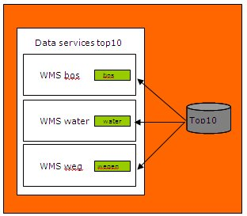

# Metadata elementen

Dit hoofdstuk beschrijft enkele verplichte elementen van het Nederlands profiel iets uitgebreider dan in de specificatie.

## Titel van de service

De resource title is de naam van de service, ook wel titel van de service genoemd. Het is niet de technische naam van de service. Het doel van dit element is de service voldoende te identificeren voor de gebruiker. Een meer uitgebreide omschrijving van de service kan gegeven worden in een ander veld, namelijk resource abstract. Wanneer er verschillende versies van een service in de meta-informatie opgenomen moeten worden, is het aan te raden om de verschillende versienummers op een gelijke wijze in de service naam te verwerken. Aanbevolen schrijfwijze voor dit element is:

(projectkenmerk) onderwerp (locatiekenmerk) (jaar) (versie) (protocol)
Hierbij zijn de onderdelen tussen haakjes niet verplicht, de andere wel.

<aside class="example" title="Titel van de service">
<ol>
<li>INSPIRE View service voor gebieden met natuurrisico's (WMS)</li>
<li>Pilod SPARQL endpoint Almere</li>
<li>DANK - Biomassa-Bos-tak- en tophout WFS</li></ol></aside>

## Datum van de bron

Het metadata element datum van de bron geeft de creatie-, publicatie-, of wijzigingdatum van de service. 
Het formaat van de datum is JJJJ-MM-DD (met streepjes).

Op z’n minst één van de elementen Datum creatie, Datum publicatie of Datum revisie is verplicht. 
Er kan maximaal één creatie datum worden opgenomen. Voor INSPIRE geldt ook een maximum van één revisie datum.

Voorbeelden:

<aside class="example" title="Datum van de bron">
<ol><li>2018-01-20</li>
<li>2016-11-04</li></ol></aside>

### Datum type van de bron

Het element datum type van de bron bevat het type gebeurtenis waar de datum betrekking op heeft. 

Mogelijke waarden zijn;

| Naam |  Waarde |  Beschrijving |
| --- | --- | --- |
| creatie |   creation |  Datum waarop de dataset of dataset serie is gecreëerd. |
| publicatie | publication | Publicatie datum waarop de dataset of dataset serie is gepubliceerd. |
| revisie | revision | Datum waarop de dataset of dataset serie is gecontroleerd, verbeterd of is gewijzigd. | 

<aside class="example" title="Datum type van de bron">
<ol><li>publication</li>
<li>creation</li></ol></aside>

## Samenvatting

De resource abstract is de samenvatting van de inhoud van de service.
In dit element kan een meer uitgebreide beschrijving van de service gegeven worden. Een service kan samengesteld zijn uit verschillende datasets. Hierdoor kan de samenvatting afwijken van de samenvatting van een dataset.

<aside class="example" title="Samenvatting">
<ol>Deze webservice toont de jaargemiddelde cijfers van het Nationaal Meetnet Radioactiviteit van het RIVM zoals in het kader van het EURATOM verdrag verzameld. De data is op diverse meetlocaties verspreid over Nederland gemeten.</ol></aside>

<aside class="example" title="Hiërarchieniveau naam">
<ol>Webservice</ol></aside>

## Verantwoordelijke organisatie bron

Verantwoordelijke organisatie bron is het metadata element waarin de de identificatie van de verantwoordelijke organisatie wordt aangegeven. Van de organisatie wordt de volledige organisatie naam vastgelegd behorende bij een bepaalde rol.

De naam van de organisatie wordt altijd voluit geschreven en in volgorde van hiërarchie. De afkorting kan toegevoegd worden aan de organisatienaam. Voor de correcte overheidsnamen zie: http://www.overheid.nl/overheidsorganisaties.

<aside class="example" title="organisatie bron">
<ol>
<li>Nederlandse organisatie voor toegepast-natuurwetenschappelijk onderzoek (TNO)</li>
<li>Rijkswaterstaat Data en ICT Dienst (RWS DID) </li>
<li>Planbureau voor de Leefomgeving (PBL)</li></ol></aside>

### Verantwoordelijke organisatie bron: e-mail

Dit element bevat het e-mail adres van de verantwoordelijke organisatie van de service. Dit kan een persoonlijk e-mailadres zijn, maar ook een algemeen e-mailadres of een e-mailadres van een loket.

<aside class="example" title="E-mail">
<ol>
<li>dinoloket@tno.nl</li>
<li>geoloket@pbl.nl</li></ol></aside>

### Verantwoordelijke organisatie bron: rol

De rol van de verantwoordelijke organisatie bron beschrijft op welke manier een bepaalde organisatie betrokken is bij een service. Er kunnen meerdere organisaties met verschillende rollen bij een dataset betrokken zijn. Een organisatie kan ook meerdere rollen hebben.

De volgende waardes zijn mogelijk;

|Naam|  Waarde| Beschrijving
|---|---|---|
|verstrekker |  resourceProvider| Organisatie die de data verstrekt.
|beheerder  |custodian  |Partij die verantwoordelijkheid heeft geaccepteerd en zorg draagt voor het beheer van de data.
|eigenaar   |owner  |Partij die eigenaar is van de data.
|gebruiker  |user |Partij die de data gebruikt.
|distributeur|  distributor |Partij die de data verstrekt.
|maker  |originator |Partij die de data heeft gecreëerd.
|contactpunt|   pointOfContact  |Partij waarmee contact kan worden opgenomen voor het vergaren van kennis of verstrekking van de data.
|inwinner|  principalInvestigator|  Sleutelpartij verantwoordelijk voor verzamelen van data en de uitvoering van onderzoek.
|bewerker|  processor |Partij die de data heeft bewerkt, zodanig dat de data is gewijzigd.
|uitgever|  publisher |Partij die de data publiceert.
|auteur | author  |Partij die auteur is van de data.

## Trefwoord

Het element keyword value bevat in het algemeen gebruikte woorden of geformaliseerde zinnen om een service te beschrijven. Dit kunnen trefwoorden uit een thesaurus zijn maar ook zelf gedefinieerde trefwoorden. Er kunnen meerdere trefwoorden worden gebruikt, maar het is geen uitputtende lijst.

Voor INSPIRE services dient er op z’n minst één keyword de categorie of subcategorie te bevatten uit deel D.4 van de commissie regulation 1205/2008, zie bijlage 1. Daarnaast kunnen er andere keywords met bijvoorbeeld het thema worden opgenomen. In http://www.eionet.europa.eu/gemet/inspire_themes zijn de thema’s van INSPIRE opgenomen.[1]

Voor WMS kan de waarde infoMapAccessService worden toegepast. Voor WFS dient er op z’n minst infoFeatureAccessService aangegeven te worden. Dit kan default worden ingevuld

<aside class="example" title="DCP">
<ol>infoMapAccessService</ol></aside>

### Thesaurus

Een thesaurus is een lijst met trefwoorden die ontleend zijn aan het dagelijks taalgebruik van professionals. In de thesaurus wordt de betekenis van trefwoorden vastgelegd door relaties te benoemen met synonieme begrippen, bredere, specifiekere en verwante begrippen en door een uitleg bij de trefwoorden. Voor INSPIRE wordt gebruik gemaakt van de GEMET thesaurus. Daarin worden de INSPIRE thema’s opgenomen. Zie  http://www.eionet.europa.eu/gemet/inspire_themes 

Thesaurus een conditioneel element. Het thesaurus element is verplicht als een trefwoord uit een thesaurus afkomstig is zoals in ieder geval voor de INSPIRE thema’s. Het bevat de naam van de thesaurus waar het trefwoord uit afkomstig is.

<aside class="example" title="Thesuarus">
<ol>
  <li>[Eurovoc](http://eurovoc.europa.eu)</li>
  <li>
[overheid:UniformeProductnaam (UPL)](http://standaarden.overheid.nl/owms/4.0/doc/waardelijsten/overheid.uniformeproductnaam)</li>
  <li>[GEMET - INSPIRE themes, version 1.0](http://www.eionet.europa.eu/gemet/en/themes/)</li>
  <li>[INSPIRE feature concept dictionary](http://inspire.ec.europa.eu/featureconcept)</li>
</ol></aside>

### Thesaurus datum

Het bevat de creatie-, publicatie-, of wijzigingsdatum, van de thesaurus waar het trefwoord uit afkomstig is. Het formaat van de datum is JJJJ-MM-DD (met streepjes).

Dit is een conditioneel element. Het is verplicht als een trefwoord uit een thesaurus afkomstig is zoals in ieder geval voor de INSPIRE thema’s.

<aside class="example" title="DCP">
<ol>2017-05-15</ol></aside>

### Thesaurus datum type

Het thesaurus datum type element bevat het type gebeurtenis waar de datum betrekking op heeft.

Dit is een conditioneel element. Het is verplicht als een trefwoord uit een thesaurus afkomstig is zoals in ieder geval voor de INSPIRE thema’s.

Mogelijke waarden zijn;

| Naam |  Engelse naam |  Beschrijving |
| --- | --- | --- |
| creatie |   creation |  Datum waarop de dataset of dataset serie is gecreëerd. |
| publicatie | publication | Publicatie datum waarop de dataset of dataset serie is gepubliceerd. |
| revisie | revision | Datum waarop de dataset of dataset serie is gecontroleerd, verbeterd of is gewijzigd. |

## Juridische toegangsrestricties

Juridische toegansrestricties is het metadata element dat de toegangseisen bevat die er zorg voor dragen dat privacy of 
intellectueel eigendom gewaarborgd zijn en elke andere speciale beperkingen voor het verkrijgen of gebruiken van de data.

Het is verplicht zowel juridische toegangsrestricties als voorwaarden voor toegang en gebruik op te nemen.

Mogelijke waarden zijn;

| Naam  | waarde |  Beschrijving |
| --- | --- | --- |
| copyright | copyright | Exclusief recht voor publicatie, productie, of verkoop van rechten op een literair, theater, muzikaal of artistiek werk, of op het gebruik van een commerciële druk of label, toegekend bij wet voor een specifieke periode of tijd aan een auteur, componist, artiest of distributeur.
| patent  | patent  | Overheid heeft een exclusief recht toegekend om een uitvinding te maken, verkopen, gebruiken of in licentie uit te geven.
| patent in wording | patent Pending |  Geproduceerde of verkochte informatie wachtend op een patent.
| merknaam |  trademark | Een naam, symbool of ander object om een product te identificeren, wat officieel geregistreerd is en gebruik wettelijk is voorbehouden aan de eigenaar of fabrikant.
| licentie |  license | Formele toestemming of iets te doen.
| intellectueel eigendom |  intellectual Property Rights  | Recht op een financieel voordeel van en controle hebben op de distributie van een niet tastbaar eigendom wat het resultaat is van creativiteit.
| niet toegankelijk | restricted  | Verbod op distributie en gebruik.
| anders |  other Restrictions |  Restrictie niet opgenomen in lijst

Voor INSPIRE datasets, bevat dit element de waarde "otherRestrictions". 
Voor organisaties die zich conformeren aan afspraken in het GI-beraad, bevat dit element ook de waarde "otherRestrictions".

Toelichting
De Nederlandse overheid wil overheidsinformatie zoveel mogelijk gratis en zonder gebruiksvoorwaarden beschikbaar stellen. Dat geldt ook voor geo-informatie. Het ministerie van Infrastructuur en Milieu hanteert Creative Commons ZERO als de voorkeurslicentie (om aan te geven dat een werk zonder restricties gebruikt kan worden) voor data van haar ministerie.

In Nederland is afgesproken om voor geo-informatie gebruik te maken van de gebruiksvoorwaarden van Creative Commons , tenzij dat niet mogelijk is. Dit “Creative Commons, tenzij” beleid is in 2014 vastgesteld door het GI-beraad.

In sommige gevallen is het toch noodzakelijk om gebruiksvoorwaarden te handhaven die niet in Creative Commons zijn opgenomen, bijvoorbeeld door wetgeving. In die gevallen biedt Geo Gedeeld uitkomst. Geo Gedeeld is een hulpmiddel om gebruiksvoorwaarden voor geo-informatie op een eenvoudige, heldere en gestandaardiseerde manier kenbaar te maken. Het is ontstaan uit de behoefte van de overheid om de bestaande gebruiksvoorwaarden voor geo-informatie te stroomlijnen. Zie ook algemeen gebruiksvoorwaarden

In het geval van een INSPIRE dataset dient twee maal het element MD_LegalConstraints gebruikt te worden.

<aside class="example" title="Juridische toegangsrestricties">
<ol>otherRestrictions</ol></aside>

### Overige beperkingen 

Dit element bevat de andere restricties, indien bij toegangs- en/of gebruiks restricties of veiligheidsresricties 
voor de waarde 'anders' gekozen is.

Dit element is dan ook verplicht bij restricties waar de waarde 'anders' is gekozen.

Mogelijke waarden;

| Waarde |  Beschrijving |
| --- | --- |
|[Open data (publiek)](http://creativecommons.org/publicdomain/mark/*/deed.nl)|   Geen beperkingen
|[Open data (CCO)](http://creativecommons.org/publicdomain/zero/*/deed.nl)|   Geen beperkingen
|[Open data (CC-BY)](http://creativecommons.org/licenses/by/*/deed.nl)|   Naamsvermelding verplicht, organisatienaam
|[Gebruiksvoorwaarden (CC-by-sa)](http://creativecommons.org/licenses/by-sa/*/deed.nl)|   Gelijk Delen, Naamsvermelding verplicht, organisatienaam
|[Gebruiksvoorwaarden (CC-by-nc)](http://creativecommons.org/licenses/by-nc/*/deed.nl)|   Niet Commercieel, Naamsvermelding verplicht, organisatienaam
|[Gebruiksvoorwaarden (CC-by-nc-sa)](http://creativecommons.org/licenses/by-nc-sa/*/deed.nl)|   Niet Commercieel, Gelijk Delen, Naamsvermelding verplicht, organisatienaam
|[Gebruiksvoorwaarden (CC-by-nd)](http://creativecommons.org/licenses/by-nd/*/deed.nl)|   Geen Afgeleide Werken, Naamsvermelding verplicht, organisatienaam
|[Gebruiksvoorwaarden (CC-by-nc-nd)](http://creativecommons.org/licenses/by-nc-nd/*/deed.nl)|   Niet Commercieel, Geen Afgeleide Werken, Naamsvermelding verplicht, organisatienaam
|[Gebruiksvoorwaarden Geogedeeld](Verwijzing naar een geldige URL van de licentie)|   Geo Gedeeld licentie

Voor INSPIRE dient tevens beschreven te worden of er restricties gelden op toegang en gebruik.

Mogelijke waarden;

| Waarde |  Beschrijving |
| --- | --- |
|[conditionsUnknown](http://inspire.ec.europa.eu/metadata-codelist/ConditionsApplyingToAccessAndUse/conditionsUnknown)  | Condities zijn onbekend
|[noConditionsApply](http://inspire.ec.europa.eu/metadata-codelist/ConditionsApplyingToAccessAndUse/noConditionsApply) |    Er zijn geen condities voor toegang en gebruik

Voor INSPIRE dient tevens beschreven te worden of er restricties gelden op publieke toegang

Mogelijke waarden;

| Waarde |  Beschrijving |
| --- | --- |
| [Geen beperkingen voor publieke toegang](http://inspire.ec.europa.eu/metadata-codelist/LimitationsOnPublicAccess/noLimitations)|  Geen Limitaties | 
| [INSPIRE_Directive_Article13_1a](http://inspire.ec.europa.eu/metadata-codelist/LimitationsOnPublicAccess/INSPIRE_Directive_Article13_1a)|   Publieke toegang beperkt ivm afbreuk van het vertrouwelijke karakter van handelingen van overheidsinstanties, indien deze vertrouwelijkheid bij wet is voorzien |
| [INSPIRE_Directive_Article13_1b](http://inspire.ec.europa.eu/metadata-codelist/LimitationsOnPublicAccess/INSPIRE_Directive_Article13_1b)| INSPIRE_Directive_Article13_1b  Publieke toegang beperkt ivm afbreuk van internationale betrekkingen, openbare veiligheid of nationale defensie |
| [INSPIRE_Directive_Article13_1c](http://inspire.ec.europa.eu/metadata-codelist/LimitationsOnPublicAccess/INSPIRE_Directive_Article13_1c)| INSPIRE_Directive_Article13_1c  Publieke toegang beperkt ivm afbreuk van de rechtsgang, de mogelijkheid voor een persoon een eerlijk proces te krijgen of de mogelijkheid voor een overheid om een onderzoek van strafrechtelijke of disciplinaire aard in te stellen |
| [INSPIRE_Directive_Article13_1b](http://inspire.ec.europa.eu/metadata-codelist/LimitationsOnPublicAccess/INSPIRE_Directive_Article13_1d)| INSPIRE_Directive_Article13_1d  Publieke toegang beperkt ivm afbreuk van de vertrouwelijkheid van commerciële of industriële informatie, wanneer deze vertrouwelijkheid in de nationale of de communautaire wetgeving geboden wordt om een gewettigd economisch belang te beschermen, met inbegrip van het algemeen belang dat met statistische en fiscale geheimhouding is gediend
| [INSPIRE_Directive_Article13_1e](http://inspire.ec.europa.eu/metadata-codelist/LimitationsOnPublicAccess/INSPIRE_Directive_Article13_1e)| INSPIRE_Directive_Article13_1e  Publieke toegang beperkt ivm afbreuk van intellectuele-eigendomsrechten |
| [INSPIRE_Directive_Article13_1f](http://inspire.ec.europa.eu/metadata-codelist/LimitationsOnPublicAccess/INSPIRE_Directive_Article13_1f)| INSPIRE_Directive_Article13_1f  Publieke toegang beperkt ivm afbreuk van de vertrouwelijkheid van persoonsgegevens en/of -dossiers met betrekking tot een natuurlijk persoon wanneer die persoon niet heeft ingestemd met bekendmaking van de informatie aan het publiek, wanneer in deze vertrouwelijkheid is voorzien in het nationaal of het Gemeenschapsrecht
| [INSPIRE_Directive_Article13_1g](http://inspire.ec.europa.eu/metadata-codelist/LimitationsOnPublicAccess/INSPIRE_Directive_Article13_1g)| INSPIRE_Directive_Article13_1g  Publieke toegang beperkt ivm afbreuk van de belangen of de bescherming van diegene die de verzochte informatie op vrijwillige basis heeft verstrekt zonder daartoe wettelijk verplicht te zijn of te kunnen worden, tenzij die persoon ermee heeft ingestemd dat de betrokken informatie wordt vrijgegeven
| [INSPIRE_Directive_Article13_1h](http://inspire.ec.europa.eu/metadata-codelist/LimitationsOnPublicAccess/INSPIRE_Directive_Article13_1h)| INSPIRE_Directive_Article13_1h  Publieke toegang beperkt ivm afbreuk van de bescherming van het milieu waarop die informatie betrekking heeft, zoals de habitat van zeldzame soorten |

<aside class="example" title="XML notatie open data licentie"><pre><code>
&lt;gmd:resourceConstraints>
  &lt;gmd:MD_LegalConstraints>
    &lt;gmd:useLimitation>
      &lt;gco:CharacterString>Geen gebruiksbeperking&lt;/gco:CharacterString>
    &lt;/gmd:useLimitation>
    &lt;gmd:accessConstraints>
      &lt;gmd:MD_RestrictionCode 
        codeList="http://www.isotc211.org/2005/resources/codeList.xml#MD_RestrictionCode"
        codeListValue="otherRestrictions"/>
    &lt;/gmd:accessConstraints>
    &lt;gmd:otherConstraints>
       &lt;gco:CharacterString> Geen beperkingen &lt;/gco:CharacterString>
    &lt;/gmd:otherConstraints>
    &lt;gmd:otherConstraints>
       &lt;gco:CharacterString>
         http://creativecommons.org/publicdomain/mark/1.0/deed.nl
       &lt;/gco:CharacterString>
    &lt;/gmd:otherConstraints>
  &lt;/gmd:MD_LegalConstraints>
&lt;/gmd:resourceConstraints>
</code></pre></aside>

## Gebruiksbeperkingen

Gebruiksbeperkingen bevat toepassingen waarvoor de dataset niet geschikt is, maar kan ook prijsinformatie voor het gebruik van de dataset bevatten.

De volgende voorbeelden zijn praktijkvoorbeelden, deze disclaimers kunnen beter opgenomen worden bij overige beperkingen.

<aside class="warning" title="Onjuiste voorbeelden gebruiksbeperkingen">
<ol>
<li>Zie http://www.rijkswaterstaat.nl/apps/geoservices/legal/NWB_disclaimer.html</li>
<li>geen - none</li>
</ol></aside>

<aside class="example" title="Correcte voorbeelden gebruiksbeperkingen"> 
<ol>
<li>Niet te gebruiken voor navigatie </li>
<li>Voor gebruik van deze dataset wordt een vergoeding van 100 euro gevraagd</li>
</ol></aside>

## Ruimtelijk referentiesysteem

Het element bevat de Alfanumerieke waarde van de door de service ondersteunde referentiesystemen. EPSG geeft deze code’s uit. Voor het Rijksdriehoek stelset wordt de code 28992 gehanteerd. Referentiesystemen worden met een URI die ook de code bevat opgenomen.

Dit element is conditioneel, het is voor INSPIRE interoperabele services verplicht om de coördinaat referentie systemen die de service ondersteunt op te nemen.

<aside class="example" title="Ruimtelijk referentiesysteem"> 
<ol>[epsg:28992](http://www.opengis.net/def/crs/EPSG/0/28992)</ol></aside>

## Geografische locatie

Dit element is conditioneel. Het is verplicht als er data aan de service is gekoppeld 
(service is dan tight of mixed coupled service).

De geographic location, ofwel geografische locatie kan op drie manier worden beschreven: 

1. door een bounding polygon, 
2. door een bounding box of 
3. door een beschrijving.

De bounding box is de kleinste extent die mogelijk is waarmee de map goed weergegeven wordt. De coördinaten dienen te worden weergegeven volgens referentiesysteem WGS 84.

### Minimum x/y, maximum x/y-coördinaten

Deze elementen bevatten de meest westelijke, zuidelijk, oostelijk en noordelijke coördinaten uit de dekking van de dataset weergegeven in longitude en lattitude in decimale graden (noord en oost als positieve waarden). De coördinaten dienen te worden weergegeven volgens referentiesysteem WGS84. Als de coordinaten niet (in WGS 84) bekend zijn kan de volgende tool ze opzoeken en/of omrekenen naar WGS 84

<aside class="example" title="Geografische locatie coordinaten">
<ol>2.50, 50.0, 3.0, 51.0</ol></aside> 

### Geografische identifier

Het is mogelijk de locatie van een service te beschrijven aan de hand van een referentie naar de URI van het betreffende gebied.

<aside class="example" title="Geografische locatie beschrijving">
<ol>[Berg_en_Dal](http://standaarden.overheid.nl/owms/terms/Berg_en_Dal)</ol></aside> 

## Distributie

### URL

Dit element bevat een valide URL voor online toegang tot de service.

Voor een service bevat het element een accessPoint URL.

Voor bijvoorbeeld services waar een restrictieve toegang voor geldt kan dit element ook de URL naar de betaalservice, of de URL naar een applicatie die direct toegang geeft tot de service bevatten.

De URL wordt zodanig aangeboden, dat deze altijd direct een resultaat geeft, zonder dat deze bevraagd wordt. De url mag geen HTTP 0, 400 of 5XX melding opleveren, neem daarom voor OGC services een volledige capabilities url op.

Dit element is conditioneel. Het is verplicht indien de service publiek of met restricties toegankelijk is en onder de verantwoordelijkheid van de beherende organisatie valt.

<aside class="example" title="URL">
<ol><li>http://services.rce.geovoorziening.nl/rce/wms?request=GetCapabilities&service=WMS</li>
<li>http://services.rce.geovoorziening.nl/www/download/nl.xml</li></ol></aside>

### Protocol

Het metadata element bevat het protocol voor het afhandelen van de URL. Het element protocol geeft aan wat voor URL het betreft. 

Het element protocol, is van belang voor het automatisch kunnen downloaden van de dataset, en/of het benaderen van de service die deze dataset representeert. Het maakt gebruik van een codelijst die het Nederlandse metadata profiel op ISO19119 wordt vastgelegd, maar het element is een ISO19115 element. Door gebruik te maken van deze codelijst is de invulling van het element software onafhankelijk.

Dit element is conditioneel. Het is verplicht als er een URL is opgegeven. 

Voor protocol van een accessPoint kunnen de volgende waarden worden gebruikt; 

| Waarde  | Beschrijving | 
| --- | --- | --- |
|[OGC:CSW](http://www.opengeospatial.org/standards/cat) | Web Catalog service |
|[OGC:WMS](http://www.opengeospatial.org/standards/wms) | Web Map service |
|[OGC:WMTS](http://www.opengeospatial.org/standards/wmts) | Web Map Tile Service |
|[OGC:WFS](http://www.opengeospatial.org/standards/wfs) | Web Feature Service |
|[OGC:WCS](http://www.opengeospatial.org/standards/wcs) | Web Coverage Service |
|[OGC:SOS](http://www.opengeospatial.org/standards/sos) | Sensor Observation Service |
|INSPIRE Atom | Atom Service Feed |
|[OGC:WCTS](http://www.opengeospatial.org/standards/) | Web Coordinate Transformation Service |
|[OGC:WPS](http://www.opengeospatial.org/standards/wps) | Web Processing Service |
|OGC:WFS-G | Gazetteer service |
|[OGC:SPS](http://www.opengeospatial.org/standards/sps) | Sensor Planning Service |
|[OGC:SAS](http://www.ogcnetwork.net/SAS) | Sensor Alert Service |
|OGC:WNS | Web Notification Service |
|[OGC:ODS](http://www.opengeospatial.org/standards/ols#ODS) | OpenLS Directory Service |
|[OGC:OGS](http://www.opengeospatial.org/standards/ols#OGS) | OpenLS Gateway Service |
|[OGC:OUS](http://www.opengeospatial.org/standards/ols#OUS) | OpenLS Utility Service |
|[OGC:OPS](http://www.opengeospatial.org/standards/ols#OPS) | OpenLS Presentation Service |
|[OGC:ORS](http://www.opengeospatial.org/standards/ols#ORS) | OpenLS Route Service |
|[OGC:SensorThings](http://www.opengeospatial.org/standards/sensorthings) | SensorThings API |
|[W3C:SPARQL](https://www.w3.org/TR/rdf-sparql-query/) | SPARQL Query Language for RDF |
|[OASIS:OData](https://www.oasis-open.org/committees/odata) | Open data protocol |
|[OAS](https://github.com/OAI/OpenAPI-Specification) | Open API Specification |
|landingpage | Een webpagina die toegang geeft tot de dataset of overige informatie bevat |
|application | Een (web) applicatie die rechtstreeks toegang geeft tot de dataset |
|dataset | Referentie naar een locale dataset locatie |
|UKST | Unknown Service Type |

<aside class="example" title="Protocol">
<ol>[OGC:WMS](http://www.opengeospatial.org/standards/wms)</ol></aside>

### Omschrijving van het type bron ontsluiting

Dit element beschrijft het type van de URL. In het geval van service is dit 
een accessPoint. Een accessPoint URL levert informatie over de service inclusief 
zijn endPoints. Dat kan bijvoorbeeld een capabilities of WSDL document zijn of 
een webpagina of applicatie waar data te downloden is. 

Omschrijving is optioneel.

Mogelijk waarde is;

| Waarde |  Beschrijving |
| --- | --- |
| [accessPoint](http://inspire.ec.europa.eu/metadata-codelist/OnLineDescriptionCode/accessPoint) |  Een internetadres dat een gedetailleerde beschrijving van een dienst met betrekking tot ruimtelijke gegevens bevat, met inbegrip van een lijst van eindpunten waarmee hij kan worden uitgevoerd

<aside class="example" title="Omschrijving van het type bron ontsluiting"><pre><code>
&lt;gmx:Anchor
  xlink:href="http://inspire.ec.europa.eu/metadata-codelist/OnLineDescriptionCode/accessPoint">
  accessPoint&lt;/gmx:Anchor>
</code></pre></aside>

## Service type

Dit element bevat het type van de service.

De implementing rules van INSPIRE verplichten het gebruik van de waardes uit Annex B.3. Deze zijn in codelijst SV_ServiceType opgenomen. Voor INSPIRE spatial data services dient de waarde "other" gekozen te worden.

Mogelijke waarden zijn;

| Waarde | Omschrijving |
| -- | -- |
| [discovery](http://inspire.ec.europa.eu/metadata-codelist/SpatialDataServiceType/discovery) | OGC:CSW; Web Catalog service |
| [view](http://inspire.ec.europa.eu/metadata-codelist/SpatialDataServiceType/view) | OGC:WMS;Web Map service of OGC:WMTS; Web Mapping Tiling Service |
| [download](http://inspire.ec.europa.eu/metadata-codelist/SpatialDataServiceType/download) | OGC:WFS; Web Feature Service of OGC:WCS; Web Coverage Service of OGC:SOS; Sensor Observation Service of INSPIRE Atom; Atom Service Feed |
| [transformation](http://inspire.ec.europa.eu/metadata-codelist/SpatialDataServiceType/transformation) | OGC:WCTS; Web Coordinate Transformation Service |
| [other](http://inspire.ec.europa.eu/metadata-codelist/SpatialDataServiceType/other) | Alle spatial data services die geen INSPIRE netwerk service zijn |

<aside class="example" title="Service type"><ol>
view</ol></aside>

## Coupled resource

De coupled resource bevat een link naar informatie (metadata) over de data die in de service beschikbaar wordt gesteld. Het bevat een valide URL. Dit element is conditioneel. Het is verplicht als er links naar de datasets waarop de service opereert beschikbaar zijn. Voor dataservices is het dus verplicht.

Voor een WMS is het, volgens het Nederlands profiel voor WMS, verplicht een MetadataURL bij elke layer op te nemen. De MetadataURL wordt in metadata voor services in het element coupled resource opgenomen. Deze MetadataURL verwijst naar de XML van de metadata van de data in de layer.
In het geval dat de layer een dataset ontsluit, wordt verwezen naar de metadata XML van die dataset. Als een dataset meerdere malen in dezelfde service ontsloten wordt wordt voor elke layer een verwijzing naar de metadata XML van die dataset opgenomen.
Ontsluit een service meerdere datasets dan komen er meerdere metadataURL’s voor die naar de verschillende metadata XML’s verwijzen.

Het is ook mogelijk om naar het metedatarecord in een catalogus te verwijzen die de metadata van de dataset ontsluit.

<aside class="example" title="">
<ol>https://nationaalgeoregister.nl/geonetwork/srv/api/records/2a3b204a-e46a-413d-b5de-3246ac1c7645</ol></aside>

## Koppel type

het element definieert het type “koppeling” tussen een service instance en een dataset. Voor een WMS of WFS geldt de waarde 'tight'. Deze waarde kan dan ook als default gehanteerd worden.

De mogelijke waarden zijn:

|Naam | Beschrijving |
| --- | --- |
|loose  |Een service instance die niet gekoppeld is met een specifieke dataset of dataset serie. Looselycoupled services zouden een associatie kunnen hebben met een datatype door de serviceType definitie. Metadata voor data wordt niet geleverd in de service metadata.
| mixed |Een service instance die gekoppeld is met een specifieke dataset of dataset serie. Service metadata dienen zowel de service als geografische dataset te beschrijven (door middel van ISO 19115). Daarnaast kan deze service instance ook gebruikt worden met externe data (data die niet wordt beschreven door de operatesOn klasse).
| tight |Een service instance die gekoppeld is met een specifieke dataset of dataset serie. Service metadata dienen zowel de service als geografische dataset te beschrijven (door middel van ISO 19115).

## Connect Point Linkage

Het element Connect Point Linkage beschrijft het netwerkadres van de service instance.

Dit element heeft hetzelfde doel als Resource Locator. Doordat ISO 19115 en ISO 19119 niet op dit punt met elkaar zijn afgestemd zijn hier twee verschillende metadata elementen (met dezelfde doelstelling) en verschillende encoding (ISO 19139 en CSW ISO Metadata AP) ontstaan.

<aside class="example" title="Connect Point Linkage">
<ol>http://www.dinoservices.nl/wms/dinomap/M09M0817</ol></aside>

## Operaties

Per mogelijke operatie van de service kunnen diverse aspecten vastgelegd worden. 

Operaties beschrijven is verplicht als de service een INSPIRE geharmoniseerde service is en het accessPoint de operaties en parameters niet beschrijft.

### Operatie naam

Het element operation name geeft de naam van de operatie weer. Aangezien het serviceType en serviceTypeVersion verplicht zijn, kunnen de bijbehorende verplichte operaties (OperationName) en parameters (SV_Parameter) worden afgeleid. Deze attribuutwaarden kunnen als default door de applicatie worden toegevoegd. Daarnaast kunnen optionele waarden handmatig worden toegevoegd.

<aside class="example" title="Operatie naam">
<ol>getMap</ol></aside>

### DCP

Dit element bevat het Distributed Computing Platforms waarop de operatie is geïmplementeerd. INSPIRE gaat van de default waarde WebServices uit. Deze waarde is opgenomen in de codelijst DCPlist . De huidige attribuutwaarden worden verwijderd en ongeldig verklaard.

Mogelijke waarden zijn;

| Waarde |
| --- |
| XML |
| CORBA |
| JAVA  |
| COM |
| SQL |
| WebServices |

<aside class="example" title="DCP">
<ol>WebServices</ol></aside>

## Parameter

De parameters van de operatie

### Parameter naam

Dit element beschrijft de naam van de parameter

<aside class="example" title="Parameter naam">
<ol>bbox</ol></aside>

#### Parameter optionaliteit

<aside class="example" title="Parameter optionaliteit">
<ol>required</ol></aside>

#### Parameter herhaalbaarheid

Dit element bevat de herhaalbaarheid van de parameter zoals gebruikt door de service

<aside class="example" title="Parameter herhaalbaarheid">
<ol>false</ol></aside>

## Niveau kwaliteitsbeschrijving

Het niveau kwaliteitsbeschrijving beschrijft het niveau waarop de kwaliteitsinformatie betrekking heeft. 

Niveau kwaliteitsbeschrijving zal deze waarde bevatten; 

| Waarde | Beschrijving |
|---|---|
| service |  Informatie heeft betrekking op de serie.|

## Niveau kwaliteitsbeschrijving naam

Dit element bevat de naam van het niveau waarop de kwaliteitsinformatie betrekking heeft.

<aside class="example" title="Niveau kwaliteitsbeschrijving naam">
<ol>service</ol></aside>

## Conformiteit met een specificatie

Dt element bevat de specificatie of richtlijnen waar de service conform aan dient te zijn. Of deze conformiteit gerealiseerd is, dan wel een verklaring met aandachtspunten.

### Specificatie

Het element specificatie bevat de titel van de specificatie of richtlijnen waar de service conform aan dient te zijn.

Dit element is conditioneel in dit profiel. Het is alleen verplicht als de service een INSPIRE bron is. Voor INSPIRE services wordt zowel de conformiteit met een verordening aangegeven als met een technische richtlijn.

Voor INSPIRE netwerk services zijn dit;

- De verordening van netwerkservices, gebruik eventueel een anchor met de volgende URI http://data.europa.eu/eli/reg/2009/976
- De technische specificatie, zoals Technical Guidance for the implementation of INSPIRE View Services

Voor INSPIRE spatial data services zijn dit;

- De verordening van interoperabiliteit van data en services, gebruik eventueel een anchor met de volgende URI http://data.europa.eu/eli/reg/2010/1089
- De technische specificatie
- De conformiteit met de categorie van de service

Mogelijke waardes voor 'categorie van de service' zijn;

| Waarde | Beschrijving |
| --- | --- |
| [invocable](http://inspire.ec.europa.eu/id/ats/metadata/2.0/sds-invocable) | Aanroepbare datadienst |
| [interoperable](http://inspire.ec.europa.eu/id/ats/metadata/2.0/sds-interoperable) | Interoperabele datadienst |
| [harmonised](http://inspire.ec.europa.eu/id/ats/metadata/2.0/sds-harmonised) | Geharmoniseerde datadienst |

<aside class="example" title="Specificatie">
<ol>Technical Guidance for the implementation of INSPIRE View Services</ol></aside>

### Specificatie datum

Het metadata element specficatie datum bevat de datum van de specificatie of richtlijnen of informatiemodel waar de dataset conform aan dient te zijn. Het formaat van de datum is JJJJ-MM-DD (met streepjes). In specificatie datum type wordt aangegeven of het om de creatie-, publicatie- of herzieningsdatum gaat.

Dit element is conditioneel in dit profiel. Het is alleen verplicht als de dataset een INSPIRE bron is of als de informatie is gemodelleerd volgens een specifiek informatie model.

<aside class="example" title="Specificatie datum">
<ol>2009-05-15</ol></aside>

### Specificatie datum type

De specificatie datum type bevat het type gebeurtenis waar de datum betrekking op heeft.

Dit element is conditioneel in dit profiel. Het is alleen verplicht als de dataset een INSPIRE bron is of als de informatie is gemodelleerd volgens een specifiek informatie model.

### Conformiteitsindicatie

Dit element bevat de uitslag of de betreffende conformiteit gerealiseerd is.

<aside class="example" title="Conformiteitindicatie met de specificatie">
<ol>TRUE</ol></aside>

### Verklaring

De verklaring bevat de betekenis van de aangegeven conformiteit. Aangegeven kan worden op welke punten de service wel of niet conform een specificatie is. In de context van services zijn voor INSPIRE.

Dit element is conditioneel. Het is alleen verplicht als de dataset een INSPIRE bron is of als de informatie is gemodelleerd volgens een specifiek informatiemodel.

<aside class="example" title="Verklaring conformiteit">
<ol>De hier gehanteerde domeinen wijken af van de domeinen uit de dataspecificaties van INSPIRE</ol></aside>

## Conceptuele consistentie

Dit element is conditioneel in dit profiel. Het is verplicht als de service een INSPIRE interoperabele services is (aangezien in dat geval niet de algemene INSPIRE quality of service vereisten gelden). Het element bevat de minimale kwaliteit van de service die word bepaald door de verantwoordelijke partij voor die service met een verwachtte geldigheid gedurende een langere periode. 

### Criteria beschrijving

Dit element bevat de beschrijving van de meetcriteria.

Mogelijke waarden voor INSPIRE zijn;

| Waarde | Beschrijving |
| --- | --- |
| [availability](http://inspire.ec.europa.eu/metadata-codelist/QualityOfServiceCriteria/availability) | Het beschrijft het percentage tijd dat de dienst beschikbaar is. |
| [performance](http://inspire.ec.europa.eu/metadata-codelist/QualityOfServiceCriteria/performance) | Het beschrijft hoe snel een aanvraag naar de ruimtelijke datadienst kan worden afgerond. |
| [capacity](http://inspire.ec.europa.eu/metadata-codelist/QualityOfServiceCriteria/capacity) | Het beschrijft het maximale aantal gelijktijdige verzoeken die met de aangegeven prestatie kunnen worden afgerond. |
 
<aside class="example" title="Criteria beschrijving">
<ol>[availability](http://inspire.ec.europa.eu/metadata-codelist/QualityOfServiceCriteria/availability)</ol></aside>

### Criteria waarde

Dit element bevat de meetwaarde van de criteria.

<aside class="example" title="Criteria type waarde">
<ol>80</ol></aside>

### Criteria type waarde

Het bevat de meeteenheid waarmee de criteria is vastgelegd.

<aside class="example" title="Criteria type waarde">
<ol>urn:ogc:def:uom:OGC::percent</ol></aside>

## Metadata unieke identifier

Metadata unieke identifier bevat de unieke identificatie voor de metadata file. Geadviseerd wordt om gebruik te maken van een betekenisloze identifier die wereldwijd uniek is zoals de [Universal Unique Identifier](http://en.wikipedia.org/wiki/UUID). De identifier bevat geen hoofdletters of accolades.

<aside class="example" title="Metadata unieke identifier">
<ol>550e8400-e29b-41d4-a716-446655440000</ol></aside>

## Metadata datum

De datum waarop de metadata is gemaakt. 
INSPIRE verplicht de creatie datum, in het profiel versie 1.1 was het ook mogelijk om de publicatie of wijzigingsdatum te kiezen. Het formaat van de datum is JJJJ-MM-DD (met streepjes).

<aside class="example" title="Metadata datum">
<ol>2008-02-25</ol></aside>

## Taal van de metadata

In dit element wordt vastgelegd in welke taal de metadata is beschreven. Gebruik hiervoor alleen de drie-letter codes van 639-2/B (bibliographic codes), zoals gedefinieerd op http://www.loc.gov/standards/iso639-2/.

Voor Nederland is over het algemeen de default waarde: dut.

## Hiërarchieniveau

Het element resource type geeft aan waarop de metadata betrekking heeft. Voor dataservices is dat service, bij metadata voor data kan dat dataset of serie zijn. Deze waarde kan als default gehanteerd worden.

Resource type kan de volgende waarde bevatten;

| Naam  | Engelse naam  | Beschrijving |
| --- | --- | --- |
| service | service | Informatie heeft betrekking op de service |

## Hiërarchieniveau naam

Het element hiërarchieniveau naam bevat de naam van het hiërarchieniveau waarvoor de metadata is beschreven.

Dit element is voor services verplicht. 

## Verantwoordelijke organisatie metadata

Dit element bevat de naam van de organisatie die verantwoordelijk is voor de metadata.

Gebruik de volledig uitgeschreven naam van de verantwoordelijke organisatie. De afkorting kan toegevoegd worden aan de organisatienaam. Voor de correcte overheidsnamen zie: http://www.overheid.nl/overheidsorganisaties.

### Verantwoordelijke organisatie metadata: e-mail

Dit element bevat het e-mail adres van de organisatie verantwoordelijk voor de metadata. Dit kan een persoonlijk e-mailadres zijn, maar ook een algemeen e-mailadres of een e-mailadres van een loket.

### Verantwoordelijke organisatie metadata: rol

Dit element bevat de rol van de organisatie verantwoordelijk voor de metadata. Er kunnen meerdere organisaties met verschillende rollen bij een dataset betrokken zijn. Een organisatie kan ook meerdere rollen hebben. Voor de rol van de organisatie wordt een codelijst gehanteerd, maar pointOfContact kan als default worden gehanteerd. 

## De link naar de metadata van de dataset en dataset series vanuit de service

Deze klasse is conditioneel. Indien een service gerelateerd is aan data, dient deze data beschreven te worden met klasse MD_DataIdentification. De klasse MD_DataIdentification dient conform de Nederlandse metadatastandaard voor geografie te worden opgevoerd.

Indien de dataset al beschreven is volgens de Nederlandse metadatastandaard voor geografie, dient de metadata betreffende MD_DataIdentification via de longname MD_Identification.citation.identifier.code te worden aangeroepen. 

## Metadata standaard naam

Dit metadata element is nodig om uitbreidingen met profielen te duiden. 
Dit element bevat de naam van de standaard.

<aside class="example" title="Metadata standaard naam">
<ol>[ISO 19119](https://www.iso.org/standard/39890.html)</ol></aside> 

## Metadata standaard versie

Metadata standaard versie is nodig om uitbreidingen op standaarden aan te geven. 
Dit element bevat de versie (profiel) van de metadatastandaard die wordt gebruikt.

<aside class="example" title="Metadata standaard versie">
<ol>[Nederlands metadata profiel op ISO 19119 voor services 2.0](https://docs.geostandaarden.nl/md/mdprofiel-iso19119/)</ol></aside>  

# Opdracht metadata voor service

- Wat is het verschil tussen resource locator en connect point linkage?
- Hoe vaak komt het element scoped name voor?
- Welke elementen dient men handmatig in te vullen, welke kunnen default worden ingevuld?
